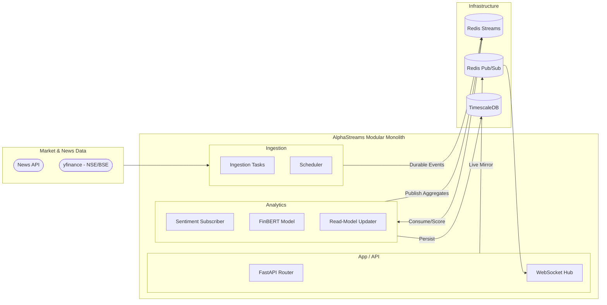
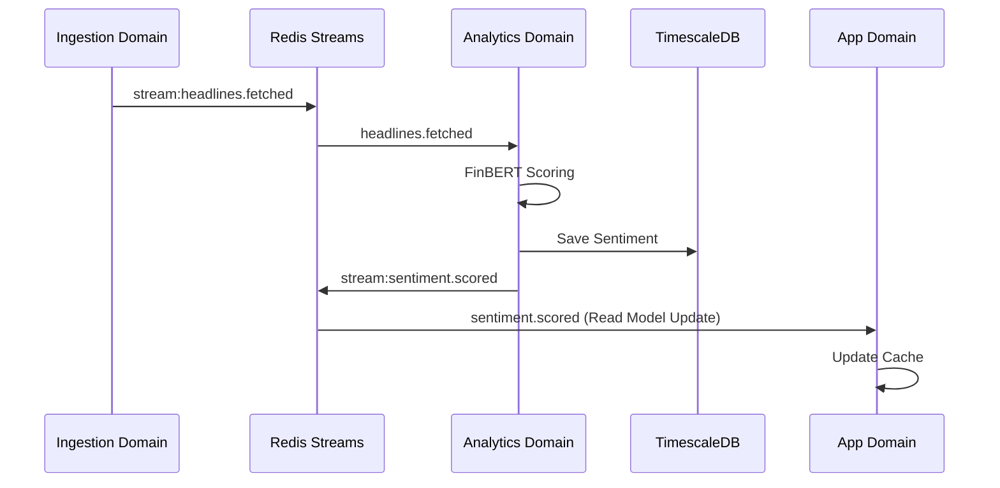
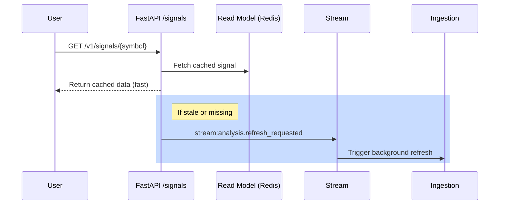

# AlphaStreams V2 — Event-Driven Quant Analytics (Indian Market Focus)

A Python-based **Event-Driven Modular Monolith** combining **FinBERT-powered Sentiment Analysis** with **Real-Time NSE/BSE Analytics** to generate actionable market overviews.

Built with **FastAPI, Celery, Redis Streams, TimescaleDB, and PyTorch**.

---

## 🛠 Tech Stack

### Backend Infrastructure

* Language: Python 3.11+
* Web Framework: [FastAPI](https://fastapi.tiangolo.com/)
* Task Queue: [Celery](https://docs.celeryq.dev/en/stable/)
* Monitoring: [Flower](https://flower.readthedocs.io/en/latest/)

### Databases & Messaging

* **Time-Series DB:** [TimescaleDB](https://www.timescale.com/) (PostgreSQL 15)
* **In-Memory Store:** [Redis 7](https://redis.io/)
* **Messaging:** Redis Streams (Durable) + Redis Pub/Sub (Live Fan-out)

### AI & Machine Learning

* NLP: [FinBERT](https://huggingface.co/ProsusAI/finbert) (Narrative analysis)
* Forecasting: Custom MTF-CNN-LSTM (PyTorch)

### Data Sources

* **Market Data:** [yfinance](https://github.com/ranaroussi/yfinance) (Restricted to Indian NSE/BSE symbols)
* **News Intelligence:** [NewsAPI](https://newsapi.org/) (Financial headlines)
* **Symbol Discovery:** Dynamic symbol retrieval for Indian markets.

---

## 💡 Architecture (Modular Monolith)



The codebase is aligned to a **Modular Monolith** with explicit context boundaries:

### Active Bounded Contexts

#### `ingestion`
* Polls news and market prices (restricted to **NSE/BSE**).
* Implements dynamic symbol retrieval for arbitrary Indian tickers.
* Publishes durable stream events.
* **Primary module:** `domains/ingestion/application/tasks/ingestion_tasks.py`

#### `analytics`
* Consumes ingestion events via Redis Streams.
* Scores headlines with FinBERT.
* Recomputes timeframe aggregates and updates read models.
* **Primary module:** `domains/analytics/infrastructure/event_subscriber.py`

#### `app`
- Exposes cache-first domain-aligned query endpoints and webhooks.
- **Primary modules:** `domains/analytics/api/` (Signals, Derivatives, Predictions, Events).

### Runtime Processes (Single-Container)

The `app` container starts these child processes via `scripts/entrypoint_single_container.sh`:

1.  **FastAPI** (`uvicorn app.main:app`)
2.  **Celery ingestion worker** (`-Q ingestion`)
3.  **Celery beat scheduler**
4.  **NLP stream subscriber** (`python domains/analytics/application/services/nlp/sentiment_orchestrator_service.py`)
5.  **Read Model Updater** (`python domains/analytics/application/services/read_model_updater_service.py`)

---

## 📡 Event Model (Durable-first)

Cross-domain correctness uses **Redis Streams** (durable, replayable, consumer-group semantics). Pub/Sub is used only for UX/live push.

### Durable streams (state/correctness path)

| Stream | Producer domain | Consumer domain | Notes |
|---|---|---|---|
*   `stream:headlines.fetched` | ingestion | analytics | Canonical fetched headlines.
*   `stream:market.price_trigger` | ingestion | analytics | Triggered market anomalies.
*   `stream:sentiment.scored` | analytics | downstream/read-model consumers | Per-headline sentiment result.
*   `stream:sentiment.aggregate_updated` | analytics | app read-model consumers | Timeframe aggregates.
*   `stream:analysis.refresh_requested` | app | ingestion | Async refresh command path.

### Ephemeral Pub/Sub mirrors (UX-only)

| Channel pattern | Purpose |
|---|---|
*   `headlines.fetched.{symbol}` | Live headline notifications.
*   `market.price_updated.{symbol}` | Live price updates.
*   `market.options_updated.{symbol}` | Live options summary updates.
*   `market.price_trigger.{symbol}` | Live trigger notifications.
*   `sentiment.scored.{symbol}` | Live scored-sentiment fan-out.
*   `sentiment.aggregate_updated.{symbol}` | Live aggregate fan-out.

**Policy:** publish critical events to durable streams first; Pub/Sub mirrors are non-replayable and not correctness-critical.

### Data Flow



---

## 🧯 Operational runbooks

The system is fully automated. Background worker startup, scheduling, and stream routing are managed by `supervisord` configured in `supervisord.conf`. Refer to supervisord logs for failure diagnostics and runbook processes.

## 🗄️ Database & Stream Visualization

### TimescaleDB (PostgreSQL)
Use **DBeaver** or **pgAdmin**:
- **Host**: `127.0.0.1`
- **Port**: `5433`
- **Database**: `NexusQuantDB`
- **Username**: `postgres`
- **Password**: `postgres`

> [!IMPORTANT]
> Use port **5433** to avoid conflicts with any local PostgreSQL service running on your host machine.

### Verification
Run this in a SQL console to verify you are connected to the correct instance (should say `Debian`):
```sql
SELECT version();
```

### Redis & Streams
Use **Redis Insight**:
- **Host**: `127.0.0.1`
- **Port**: `6379`
- **Password**: (None)

Redis Insight allows you to visualize **Redis Streams** (e.g., `stream:headlines.fetched`) in real-time.

## 🚀 Getting Started

This system is completely dockerized. All configurations are driven via the `.env` file.

1.  **Copy the Environment Template**

    ```bash
    cp .env.template .env
    ```

    Add your `NEWS_API_KEY` to `.env`.

2.  **Start the Infrastructure**

    ```bash
    docker compose up -d
    ```

    *Note: PyTorch supports both CPU and CUDA modes. If an NVIDIA GPU is available, the system automatically leverages it for 10x-20x faster training and inference benchmarking.*

3.  **Initialize the Database Schema**

    *(First Boot Only)*

    ```bash
    docker compose cp scripts/init_schema.sql postgres:/tmp/init_schema.sql
    docker compose exec postgres psql -U postgres -d NexusQuantDB -f /tmp/init_schema.sql
    ```

---

## 🧪 Interactive API Testing

The Celery scheduler and Sentiment subscribers run autonomously in the background! As data flows in, you can query the API.

### 1. Fused Composite Signals (REST)

Returns the real-time market sentiment fused with ML predictions for the Indian market indices.

```bash
curl http://localhost:8000/v1/signals/NIFTY
```

### 2. Options Derivatives Pricing (REST)

Returns Crank-Nicolson PDE priced options chain (fair pricing surface), PCR, volumes, and open interest.

```bash
curl http://localhost:8000/v1/derivatives/NIFTY
```

### 3. Market Volatility Prediction

Predicts the 5-day forward volatility shift using the MTF-CNN-LSTM model.

```bash
curl http://localhost:8000/v1/predictions/NIFTY
```

**Output Classes:**
- `VOL_CRUSH`: Significant decrease in volatility.
- `NEUTRAL`: Stable market conditions.
- `VOL_EXPAND`: Significant increase/breakout expected.

### 4. Live WebSocket Streaming (Push)

Using a websocket client (e.g. VS Code Bruno or Postman), connect to:
`ws://localhost:8000/v1/ws/NIFTY`

Events will spontaneously push to you whenever new data enters the architecture!

> [!NOTE]
> **Indian Market Hours**: The system is optimized for NSE/BSE trading (9:15 AM – 3:30 PM IST). Outside hours, it serves the last-known "CLOSED" state while continuing to poll 24/7 news APIs.

---

## 🔄 Workflow (Request-Response Path)

### `GET /v1/signals/{symbol}`

1. API validates symbol against configured watchlist.
2. Reads composite signal from Redis cache.
3. If data is missing (cache-miss), publishes an async refresh request (`stream:analysis.refresh_requested`) to trigger background update and returns initial metadata.



---

## 🏁 Suggested Onboarding Order

1. Read `README.md` for architecture, runtime details, and startup.
2. Read `shared/infrastructure/event_bus/contracts.py` and `shared/infrastructure/event_bus/streams.py` to understand event structures.
3. Read `domains/ingestion/application/tasks/ingestion_tasks.py` to see news and market price fetchers.
4. Read `domains/analytics/application/services/nlp/sentiment_orchestrator_service.py` and `domains/analytics/infrastructure/options_subscriber.py` to trace the real-time scoring, signal composition, and options fair pricing solver workflows.
5. Read `domains/analytics/api/` router modules for details on signals, derivatives, and predictions presentation logic.

