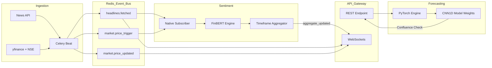

# AlphaStreams V2 — Event-Driven Quantitative Analytics using NLP and ML

A Python-based **Event-Driven Modular Monolith** that combines **Financial News Sentiment** (scored by FinBERT AI) with **Real-Time F&O Options Analytics** to generate complete market overviews and real-time streaming updates.

Built with **FastAPI, Celery, Redis Streams + Pub/Sub, TimescaleDB, and PyTorch**.

---

## 🛠 Tech Stack

### Backend Infrastructure

*   **Language:** Python 3.11+ (Asynchronous)
*   **Web Framework:** [FastAPI](https://fastapi.tiangolo.com/) (ASGI) with Uvicorn
*   **Task Queue:** [Celery](https://docs.celeryq.dev/en/stable/) (Distributed Task Management)
*   **Real-time Engine:** [WebSockets](https://fastapi.tiangolo.com/advanced/websockets/) for live push-notifications
*   **Monitoring:** [Flower](https://flower.readthedocs.io/en/latest/) (Real-time task dashboard)

### Databases & Messaging

*   **Time-Series DB:** [TimescaleDB](https://www.timescale.com/) (PostgreSQL 15) for high-performance tick storage
*   **In-Memory Store:** [Redis 7](https://redis.io/) (Used as Cache, Message Broker, and Event Bus)
*   **Messaging:** Redis Streams (durable) + Redis Pub/Sub (ephemeral live fan-out)

### AI & Machine Learning

*   **Deep Learning:** [PyTorch](https://pytorch.org/) (Custom 1D-CNN for Quant forecasting)
*   **NLP / LLM:** [HuggingFace Transformers](https://huggingface.co/docs/transformers/index) (FinBERT for narrative analysis)
*   **Feature Engineering:** [Pandas](https://pandas.pydata.org/), [NumPy](https://numpy.org/), and [SciPy](https://scipy.org/)

### Data Sources

*   **Market History:** [yfinance](https://github.com/ranaroussi/yfinance) (Yahoo Finance API)
*   **News Intelligence:** [NewsAPI](https://newsapi.org/) (Global financial headline streaming)
*   **Derivative Data:** Native NSE India Scraping/API Integration

### DevOps

*   **Containerization:** Docker & Docker Compose
*   **Architecture:** Domain-Driven Design (DDD) Modular Monolith

---

## 💡 Current-State Architecture (What is truly synchronous vs event-driven)

The repository is currently a **hybrid** runtime:

### Event-driven paths (asynchronous, decoupled)

* **Ingestion ➜ NLP/Sentiment** is event-driven via Redis Streams with consumer groups.
  * Ingestion publishes durable `stream:headlines.fetched` and `stream:market.price_trigger` events.
  * Sentiment subscriber consumes these streams, acknowledges/retries, and publishes durable downstream sentiment events.
* **Live client updates** use Redis Pub/Sub mirrors for WebSocket fan-out (`*.{symbol}` channels).
* **Background collection/refresh** is asynchronous through Celery workers + beat scheduler.

### Synchronous paths (request/response, direct reads)

* **`/v1/analyze/{symbol}`** remains synchronous from the API caller perspective.
  * It executes a cache-first read-model composition flow synchronously inside the request.
  * If data is stale/partial, it enqueues a background ingestion refresh command and returns immediately (fire-and-forget).
* **Forecasting endpoint flow** (when invoked) is synchronous request/response over in-process domain code.

### Durable vs Ephemeral Topics

| Topic | Transport | Purpose |
|---|---|---|
| `stream:headlines.fetched` | Durable (Redis Stream + consumer group) | Critical ingestion → NLP headline processing with retries/ack/DLQ semantics. |
| `stream:market.price_trigger` | Durable (Redis Stream + consumer group) | Critical ingestion → NLP trigger handling with retries/ack/DLQ semantics. |
| `stream:sentiment.scored` | Durable (Redis Stream) | Critical NLP output for downstream consumers/read models. |
| `stream:sentiment.aggregate_updated` | Durable (Redis Stream) | Critical aggregate updates for downstream consumers/read models. |
| `headlines.fetched.{symbol}` | Ephemeral (Pub/Sub) | Live websocket push mirror only. |
| `market.price_updated.{symbol}` | Ephemeral (Pub/Sub) | Live websocket updates only. |
| `market.options_updated.{symbol}` | Ephemeral (Pub/Sub) | Live websocket updates only. |
| `market.price_trigger.{symbol}` | Ephemeral (Pub/Sub) | Live websocket push mirror only. |
| `sentiment.scored.{symbol}` | Ephemeral (Pub/Sub) | Live websocket push mirror only. |
| `sentiment.aggregate_updated.{symbol}` | Ephemeral (Pub/Sub) | Live websocket push mirror only. |

---

## 🧭 Bounded Context Boundaries (Target 3-domain model)

The accepted target boundary model is:

1. **`ingestion`**
   * External connector reliability, normalization, deduplication, schema validation.
   * Emits canonical ingestion events only.
2. **`nlp_logic`**
   * Consumes ingestion contracts.
   * Performs sentiment scoring, enrichment, and derived analytics generation.
3. **`frontend_api`**
   * Serves read models and client-facing endpoints.
   * Must not run heavy NLP inline.

### Boundary rules

* Cross-context communication uses explicit versioned contracts/events.
* No cross-context domain model imports.
* Shared code is limited to non-domain concerns (config/logging/tracing/infrastructure adapters).

### Current code mapping note

The repository folders still include `app/domain/ingestion`, `app/domain/sentiment`, `app/domain/api`, plus `app/domain/forecasting`. Migration work will fold the current sentiment/forecasting responsibilities into the `nlp_logic` context contract boundary where applicable.

---

## 🚢 Deployment Model

### Current deployment (today)

`docker-compose.yml` currently runs a **multi-service compose topology**:

* `app` (FastAPI)
* `worker-ingestion` (Celery ingestion worker)
* `worker-nlp` (sentiment stream subscriber)
* `beat` (Celery scheduler)
* `flower` (monitoring)
* `redis`, `postgres`

These services share one application image but execute as separate containers/process roles.

### Migration target deployment posture

For the DDD migration transition, architecture ADRs define a **single deployable app container runtime** for domain modules (`ingestion`, `nlp_logic`, `frontend_api`) with explicit in-code boundaries and transport abstractions preserved.

In practice:

* **Code boundary target:** modular-monolith style separation by bounded context.
* **Runtime transition target:** single deployable app container for core contexts during migration.
* **Later evolution path:** split back into independently deployable services when scale/ownership/fault-isolation criteria are met.

---

## 🛣 Migration Plan: Current layout ➜ Target 3-domain DDD layout

1. **Establish boundary ownership and contracts**
   * Confirm context owners and catalog existing events/endpoints.
   * Freeze non-essential schema changes during cutover windows.

2. **Refactor module boundaries in code**
   * Remove direct cross-domain imports.
   * Introduce explicit DTO/event contracts at context edges.
   * Add architecture tests/checks for boundary enforcement.

3. **Formalize topic classification**
   * Route critical state-change events to durable streams first.
   * Keep ephemeral channels as mirror-only for UX/cache signaling.
   * Add producer policy checks to prevent critical events on ephemeral topics.

4. **Consolidate migration runtime**
   * Build/run one deployable app container carrying all three contexts.
   * Keep per-context observability tags and health probes.
   * Use feature flags for selective cutover.

5. **Dual-run validation and parity checks**
   * Shadow legacy/new flows where possible.
   * Compare sentiment outputs, derived analytics, and API response parity.
   * Fix drift before shifting meaningful traffic.

6. **Gradual cutover and stabilization**
   * Canary traffic shifts with rollback switches ready.
   * Monitor lag/latency/error/freshness SLOs.
   * Remove compatibility shims and publish post-cutover review.

---

## ⚖️ Known trade-offs

* **Latency:** Durable stream-first correctness adds hops/processing delay vs direct synchronous updates.
* **Durability:** Pub/Sub mirrors are intentionally non-replayable; correctness must rely on durable streams/read models.
* **Coupling:** A single deployable container simplifies operations but increases noisy-neighbor and release-cadence coupling until service split.

---

## 📊 Event-Driven Flow



---

## 🚀 Getting Started

This system is completely dockerized. All configurations are driven via the `.env` file.

1.  **Copy the Environment Template**

    ```bash
    cp .env.template .env
    ```

    Add your `NEWS_API_KEY` to `.env`.

2.  **Start the Infrastructure**

    ```bash
    docker compose up -d
    ```

    *Note: PyTorch initializes securely in CPU mode to drastically reduce Docker image size requirements by bypassing heavy CUDA dependencies.*

3.  **Initialize the Database Schema**

    *(First Boot Only)*

    ```bash
    docker compose cp scripts/init_schema.sql postgres:/tmp/init_schema.sql
    docker compose exec postgres psql -U postgres -d NexusQuantDB -f /tmp/init_schema.sql
    ```

---

## 🧪 Interactive API Testing

The Celery scheduler and Sentiment subscribers run autonomously in the background! As data flows in, you can query the API.

### 1. Unified Analysis Report (REST)

Returns the live options chain surface, current price, latest headlines, and the multi-timeframe FinBERT aggregations for any symbol.

```bash
curl http://localhost:8000/v1/analyze/NIFTY
```

### 2. Live WebSocket Streaming (Push)

Using a websocket client (e.g. VS Code Bruno or Postman), connect to:
`ws://localhost:8000/ws/NIFTY`
Events will spontaneously push to you whenever new prices, options, headlines, or sentiment updates enter the architecture!

> [!NOTE]
> **On Closed Markets**: Rather than crashing or blank-screening, the system gracefully degrades outside of NSE trading hours (9:15 AM – 3:30 PM IST), relying on Redis closures and asynchronous persistence to serve the last-known "CLOSED" state, while continuing to poll 24/7 web news APIs for weekend sentiment!
