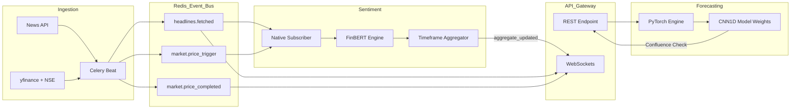

# AlphaStreams V2 — Event-Driven Quantitative Analytics using NLP and ML

A Python-based **Event-Driven Modular Monolith** that combines **Financial News Sentiment** (scored by FinBERT AI) with **Real-Time F&O Options Analytics** to generate complete market overviews and real-time streaming updates.

Built with **FastAPI, Celery, Redis Streams + Pub/Sub, TimescaleDB, and PyTorch**.

---

## 🛠 Tech Stack

### Backend Infrastructure

*   **Language:** Python 3.11+ (Asynchronous)
*   **Web Framework:** [FastAPI](https://fastapi.tiangolo.com/) (ASGI) with Uvicorn
*   **Task Queue:** [Celery](https://docs.celeryq.dev/en/stable/) (Distributed Task Management)
*   **Real-time Engine:** [WebSockets](https://fastapi.tiangolo.com/advanced/websockets/) for live push-notifications
*   **Monitoring:** [Flower](https://flower.readthedocs.io/en/latest/) (Real-time task dashboard)

### Databases & Messaging

*   **Time-Series DB:** [TimescaleDB](https://www.timescale.com/) (PostgreSQL 15) for high-performance tick storage
*   **In-Memory Store:** [Redis 7](https://redis.io/) (Used as Cache, Message Broker, and Event Bus)
*   **Messaging:** Redis Streams (durable) + Redis Pub/Sub (ephemeral live fan-out)

### AI & Machine Learning

*   **Deep Learning:** [PyTorch](https://pytorch.org/) (Custom 1D-CNN for Quant forecasting)
*   **NLP / LLM:** [HuggingFace Transformers](https://huggingface.co/docs/transformers/index) (FinBERT for narrative analysis)
*   **Feature Engineering:** [Pandas](https://pandas.pydata.org/), [NumPy](https://numpy.org/), and [SciPy](https://scipy.org/)

### Data Sources

*   **Market History:** [yfinance](https://github.com/ranaroussi/yfinance) (Yahoo Finance API)
*   **News Intelligence:** [NewsAPI](https://newsapi.org/) (Global financial headline streaming)
*   **Derivative Data:** Native NSE India Scraping/API Integration

### DevOps

*   **Containerization:** Docker & Docker Compose
*   **Architecture:** Domain-Driven Design (DDD) Modular Monolith

---

## 💡 The Architecture (Domain-Driven Design)

AlphaStreams V2 is designed using Domain-Driven Design (DDD) with strict boundaries. All cross-domain communication happens exclusively through an asynchronous **Redis Event Bus**.

### Durable vs Ephemeral Topics

| Topic | Transport | Purpose |
|---|---|---|
| `stream:headlines.fetched` | Durable (Redis Stream + consumer group) | Critical ingestion → NLP headline processing with retries/ack/DLQ. |
| `stream:market.price_trigger` | Durable (Redis Stream + consumer group) | Critical ingestion → NLP trigger handling with retries/ack/DLQ. |
| `stream:sentiment.scored` | Durable (Redis Stream) | Critical NLP output for downstream API/read-model consumers. |
| `stream:sentiment.aggregate_updated` | Durable (Redis Stream) | Critical NLP aggregate updates for downstream API/read-model consumers. |
| `headlines.fetched.{symbol}` | Ephemeral (Pub/Sub) | Live websocket push mirror only. |
| `market.price_updated.{symbol}` | Ephemeral (Pub/Sub) | Live websocket updates. |
| `market.options_updated.{symbol}` | Ephemeral (Pub/Sub) | Live websocket updates. |
| `market.price_trigger.{symbol}` | Ephemeral (Pub/Sub) | Live websocket push mirror only. |
| `sentiment.scored.{symbol}` | Ephemeral (Pub/Sub) | Live websocket push mirror only. |
| `sentiment.aggregate_updated.{symbol}` | Ephemeral (Pub/Sub) | Live websocket push mirror only. |

### 🌊 Domain 1: Data Ingestion (`/app/domain/ingestion`)

**The Market Observers**

*   Independently polls external APIs (NewsAPI, yfinance, NSE India).
*   Automatically persists historical ticks to the `TickData` timescale hypertable.
*   Analyzes rapid price action to detect and publish `Flash Drops`, `Spikes`, and `Volume Anomalies`.
*   **Publishes Events**: `headlines.fetched`, `market.price_updated`, `market.options_updated`, `market.price_trigger`.

### 🌊 Domain 2: Sentiment Analytics (`/app/domain/sentiment`)

**The "Confirming Indicator" & Natural Language Engine**

*   A stateless, real-time subscriber mapping directly onto the Redis Event Bus.
*   Uses **FinBERT AI** to syntactically score new headlines (*Bullish*, *Bearish*, *Neutral*).
*   Immediately processes `price_trigger` anomalies to inject synthetic market biases into the sentiment database.
*   Calculates continuously rolling **multi-timeframe aggregations** (Intraday, Daily, Weekly, Monthly) to measure momentum and trend drift over time.
*   **Publishes Events**: `sentiment.scored`, `sentiment.aggregate_updated`.

### 🌊 Domain 3: API Gateway (`/app/domain/api`)

**The Presentation Layer**

*   Provides lightning-fast unified REST endpoints via Redis caching.
*   Offers a seamless WebSocket interface to stream real-time price ticks, options shifts, and shifting FinBERT sentiment to the frontend UI as soon as they occur.

### 🌊 Domain 4: Forecasting (`/app/domain/forecasting`)

**The Quantitative ML Engine (CNN Confluence Check)**

*   Runs a strictly isolated CPU-based PyTorch 1D Convolutional Neural Network (`QuantCNN1D`).
*   Automatically pulls the last 60 days of closing data (`yfinance`), engineers 10 scale-invariant macro/technical features (RSI, EMAs, Bollinger Bands, Volume Momentum), and reshapes them into a 21-day timeline tensor.
*   Injects the live FinBERT sentiment directly into the `sentiment_proxy` tensor dimension.
*   Serves as the ultimate "Devil's Advocate" **Confluence Check**, yielding a technical `BULLISH/BEARISH` prediction to validate or diverge from the NLP news analysis.

---

## 📊 Event-Driven Flow



---

## 🚀 Getting Started

This system is completely dockerized. All configurations are driven via the `.env` file.

1.  **Copy the Environment Template**

    ```bash
    cp .env.template .env
    ```

    Add your `NEWS_API_KEY` to `.env`.

2.  **Start the Infrastructure**

    ```bash
    docker compose up -d
    ```

    *Note: PyTorch initializes securely in CPU mode to drastically reduce Docker image size requirements by bypassing heavy CUDA dependencies.*

3.  **Initialize the Database Schema**

    *(First Boot Only)*

    ```bash
    docker compose cp scripts/init_schema.sql postgres:/tmp/init_schema.sql
    docker compose exec postgres psql -U postgres -d NexusQuantDB -f /tmp/init_schema.sql
    ```

---

## 🧪 Interactive API Testing

The Celery scheduler and Sentiment subscribers run autonomously in the background! As data flows in, you can query the API.

### 1. Unified Analysis Report (REST)

Returns the live options chain surface, current price, latest headlines, and the multi-timeframe FinBERT aggregations for any symbol.

```bash
curl http://localhost:8000/v1/analyze/NIFTY
```

### 2. Live WebSocket Streaming (Push)

Using a websocket client (e.g. VS Code Bruno or Postman), connect to:
`ws://localhost:8000/ws/NIFTY`
Events will spontaneously push to you whenever new prices, options, headlines, or sentiment updates enter the architecture!

> [!NOTE]
> **On Closed Markets**: Rather than crashing or blank-screening, the system gracefully degrades outside of NSE trading hours (9:15 AM – 3:30 PM IST), relying on Redis closures and asynchronous persistence to serve the last-known "CLOSED" state, while continuing to poll 24/7 web news APIs for weekend sentiment!
