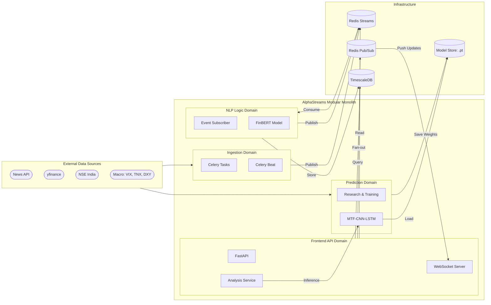

# AlphaStreams V2 — Event-Driven Quantitative Analytics using NLP and ML

A Python-based **Event-Driven Modular Monolith** that combines **Financial News Sentiment** (scored by FinBERT AI) with **Real-Time F&O Options Analytics** to generate complete market overviews and real-time streaming updates.

Built with **FastAPI, Celery, Redis Streams + Pub/Sub, TimescaleDB, and PyTorch**.

---

## 🛠 Tech Stack

### Backend Infrastructure

* Language: Python 3.11+ (Asynchronous)
* Web Framework: [FastAPI](https://fastapi.tiangolo.com/) (ASGI) with Uvicorn
* Task Queue: [Celery](https://docs.celeryq.dev/en/stable/) (Distributed Task Management)
* Real-time Engine: [WebSockets](https://fastapi.tiangolo.com/advanced/websockets/) for live push-notifications
* Monitoring: [Flower](https://flower.readthedocs.io/en/latest/) (Real-time task dashboard)

### Databases & Messaging

*   **Time-Series DB:** [TimescaleDB](https://www.timescale.com/) (PostgreSQL 15) for high-performance tick storage
*   **In-Memory Store:** [Redis 7](https://redis.io/) (Used as Cache, Message Broker, and Event Bus)
*   **Messaging:** Redis Streams (durable) + Redis Pub/Sub (ephemeral live fan-out)

### AI & Machine Learning

* Deep Learning: [PyTorch](https://pytorch.org/) (Custom MTF-CNN-LSTM for Quant forecasting with CUDA acceleration)
* NLP / LLM: [HuggingFace Transformers](https://huggingface.co/docs/transformers/index) (FinBERT for narrative analysis)
* Feature Engineering: [Pandas](https://pandas.pydata.org/), [NumPy](https://numpy.org/), [SciPy](https://scipy.org/), and Macro-indicators (VIX, TNX, DXY)

### Data Sources

*   **Market History:** [yfinance](https://github.com/ranaroussi/yfinance) (Yahoo Finance API)
*   **News Intelligence:** [NewsAPI](https://newsapi.org/) (Global financial headline streaming)
*   **Derivative Data:** Native NSE India Scraping/API Integration

### DevOps

*   **Containerization:** Docker & Docker Compose
*   **Architecture:** Domain-Driven Design (DDD) Modular Monolith

---

## 💡 Architecture (Current Runtime)



The codebase is aligned to a **3-domain DDD modular monolith** with explicit context boundaries:

### Active Bounded Contexts

#### `ingestion`
* Polls news, market prices, and option-chain snapshots.
* Writes hot cache/read-model data where appropriate.
* Publishes durable stream events for downstream consumers.
* **Primary module:** `domains/ingestion/tasks/IngestionTasks.py`

#### `nlp_logic`

* Consumes durable ingestion events via Redis Streams consumer groups.
* Scores headlines with FinBERT.
* Recomputes timeframe aggregates and publishes durable aggregate events.
* **Primary module:** `domains/analytics/application/nlp/SentimentOrchestrator.py`

#### `frontend_api`

- Exposes cache-first query endpoints.
- Publishes async refresh requests when responses are stale/partial.
- Maintains websocket live updates using Pub/Sub mirrors.
- **Primary modules:**
  - `domains/analytics/api/SentimentRouter.py`
  - `domains/analytics/api/PredictionsRouter.py`
  - `domains/analytics/api/EventsRouter.py`

#### `prediction` (Research & ML)
- Handles model training and validation using historical data.
- Implements Multi-Timeframe (MTF) sequence building.
- Provides high-performance inference via PyTorch (CPU/CUDA).
- **Primary modules:**
  - `research/TrainCNNPredictor.py`
  - `domains/analytics/application/ml_forecasting/CNNPredictor.py`

### Runtime Processes (Single-Container)

The `app` container starts these child processes via `scripts/entrypoint_single_container.sh`:

1.  **FastAPI** (`uvicorn Main:App`)
2.  **Celery ingestion worker** (`-Q ingestion`)
3.  **Celery beat scheduler**
4.  **NLP stream subscriber** (`python -m domains.analytics.application.nlp.SentimentOrchestrator`)

---

## 📡 Event Model (Durable-first)

Cross-domain correctness uses **Redis Streams** (durable, replayable, consumer-group semantics). Pub/Sub is used only for UX/live push.

### Durable streams (state/correctness path)

| Stream | Producer domain | Consumer domain | Notes |
|---|---|---|---|
*   `stream:headlines.fetched` | ingestion | nlp_logic | Canonical fetched headlines.
*   `stream:market.price_trigger` | ingestion | nlp_logic | Triggered market anomalies.
*   `stream:sentiment.scored` | nlp_logic | downstream/read-model consumers | Per-headline sentiment result.
*   `stream:sentiment.aggregate_updated` | nlp_logic | frontend_api read-model consumers | Timeframe aggregates.
*   `stream:analysis.refresh_requested` | frontend_api | ingestion | Async refresh command path.

### Ephemeral Pub/Sub mirrors (UX-only)

| Channel pattern | Purpose |
|---|---|
*   `headlines.fetched.{symbol}` | Live headline notifications.
*   `market.price_updated.{symbol}` | Live price updates.
*   `market.options_updated.{symbol}` | Live options summary updates.
*   `market.price_trigger.{symbol}` | Live trigger notifications.
*   `sentiment.scored.{symbol}` | Live scored-sentiment fan-out.
*   `sentiment.aggregate_updated.{symbol}` | Live aggregate fan-out.

**Policy:** publish critical events to durable streams first; Pub/Sub mirrors are non-replayable and not correctness-critical.

### Data Flow


---

## 🧯 Operational runbooks

* Startup runbook: [`docs/runbooks/startup.md`](docs/runbooks/startup.md)
* Failure & recovery runbook: [`docs/runbooks/failure-recovery.md`](docs/runbooks/failure-recovery.md)

## 🚀 Getting Started

This system is completely dockerized. All configurations are driven via the `.env` file.

1.  **Copy the Environment Template**

    ```bash
    cp .env.template .env
    ```

    Add your `NEWS_API_KEY` to `.env`.

2.  **Start the Infrastructure**

    ```bash
    docker compose up -d
    ```

    *Note: PyTorch supports both CPU and CUDA modes. If an NVIDIA GPU is available, the system automatically leverages it for 10x-20x faster training and inference benchmarking.*

3.  **Initialize the Database Schema**

    *(First Boot Only)*

    ```bash
    docker compose cp scripts/init_schema.sql postgres:/tmp/init_schema.sql
    docker compose exec postgres psql -U postgres -d NexusQuantDB -f /tmp/init_schema.sql
    ```

---

## 🧪 Interactive API Testing

The Celery scheduler and Sentiment subscribers run autonomously in the background! As data flows in, you can query the API.

### 1. Unified Analysis Report (REST)

Returns the live options chain surface, current price, latest headlines, and the multi-timeframe FinBERT aggregations for any symbol.

```bash
curl http://localhost:8000/v1/analyze/NIFTY
```

### 2. Market Volatility Prediction
Predicts the 5-day forward volatility shift using the MTF-CNN-LSTM model.

```bash
curl http://localhost:8000/v1/predictions/NIFTY
```

**Output Classes:**
- `VOL_CRUSH`: Significant decrease in volatility.
- `NEUTRAL`: Stable market conditions.
- `VOL_EXPAND`: Significant increase/breakout expected.

### 3. Live WebSocket Streaming (Push)
Using a websocket client (e.g. VS Code Bruno or Postman), connect to:
`ws://localhost:8000/v1/ws/NIFTY`
Events (including ML predictions) will spontaneously push to you whenever new data enters the architecture!

> [!NOTE]
> **On Closed Markets**: Rather than crashing or blank-screening, the system gracefully degrades outside of NSE trading hours (9:15 AM – 3:30 PM IST), relying on Redis closures and asynchronous persistence to serve the last-known "CLOSED" state, while continuing to poll 24/7 web news APIs for weekend sentiment!

---

## 🔄 Workflow (Request-Response Path)

### `GET /v1/analyze/{symbol}`

1. API validates symbol against configured watchlist.
2. Analysis service reads market/headline/sentiment/options/forecast from Redis-first read models.
3. If data is stale or partial, API still returns quickly and publishes an async refresh request (`stream:analysis.refresh_requested`).
4. Ingestion + NLP flows continue asynchronously and update caches/read-models consumed by API and websocket clients.


---

## 🏁 Suggested Onboarding Order

1. Read `README.md` for architecture + startup.
2. Read `docs/adr/ADR-001-bounded-contexts.md` and `docs/adr/ADR-002-event-transport.md`.
3. Read `app/shared/event_bus/contracts.py` and `app/shared/event_bus/streams.py`.
4. Read ingestion tasks and NLP subscriber modules.
5. Read frontend API service/router modules.
6. Use runbooks in `docs/runbooks/` for ops workflows.

