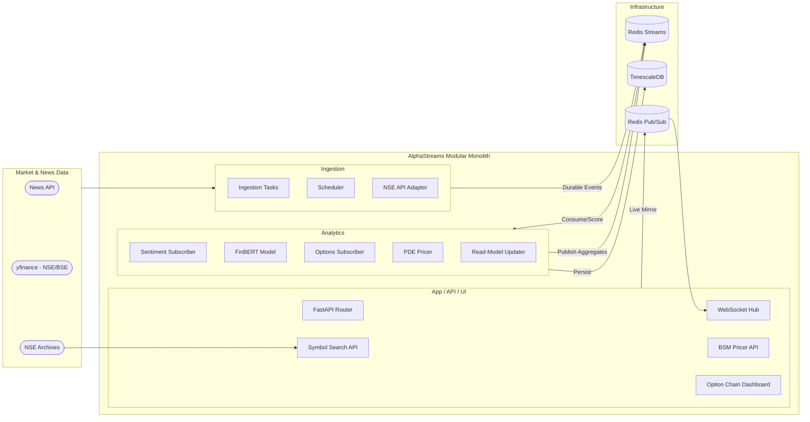
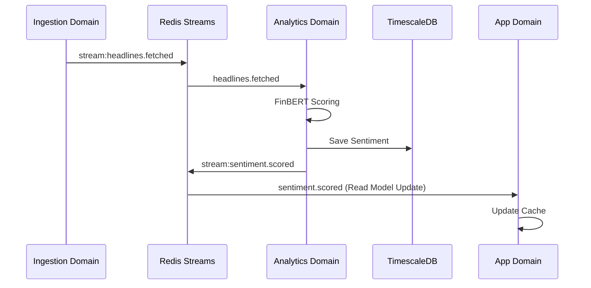
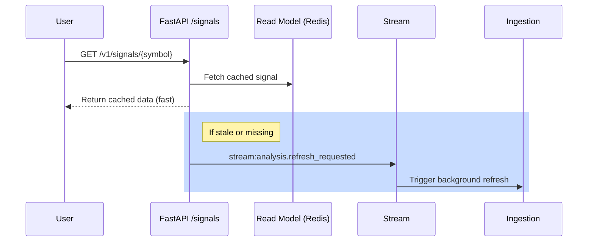

# AlphaStreams V2 — Event-Driven Quant Analytics (Indian Market Focus)

A Python-based **Event-Driven Modular Monolith** combining **FinBERT-powered Sentiment Analysis**, **Real-Time NSE/BSE Analytics**, and an **Interactive Option Chain Dashboard** to generate actionable market overviews.

Built with **FastAPI, Celery, Redis Streams, TimescaleDB, PyTorch**, and a **production-grade web UI** modelled after the NSE India option chain interface.

---

## Features

- **NSE Option Chain Dashboard** — interactive web UI cloning the NSE India option chain layout, with Calls / Strikes / Puts dual-column table.
- **Client-Side BSM Calculator** — real-time Black-Scholes-Merton pricing, full Greeks (Δ, Γ, ν, θ, ρ), and theoretical edge overlays.
- **Dynamic Instrument Search** — autocomplete search across 2,000+ NSE equities and indices via a live instrument catalog.
- **Real-Time WebSocket Push** — live price ticks, scored sentiment, and options data streamed to the UI.
- **FinBERT NLP Sentiment** — automatic financial headline scoring (BULLISH / BEARISH / NEUTRAL) using ProsusAI/FinBERT.
- **MTF-CNN-LSTM Volatility Prediction** — 5-day forward volatility forecasting (VOL_CRUSH / NEUTRAL / VOL_EXPAND).
- **Crank-Nicolson PDE Fair Pricing** — numerical PDE solver for American-style option fair values.
- **Single-Container Deployment** — everything (FastAPI, Celery, Redis, TimescaleDB, ML models) runs in one Docker container via `supervisord`.

---

## Tech Stack

### Backend Infrastructure

| Layer | Technology |
|---|---|
| Language | Python 3.11+ |
| Web Framework | [FastAPI](https://fastapi.tiangolo.com/) |
| Task Queue | [Celery](https://docs.celeryq.dev/en/stable/) |
| Process Manager | [supervisord](http://supervisord.org/) |

### Databases & Messaging

| Layer | Technology |
|---|---|
| Time-Series DB | [TimescaleDB](https://www.timescale.com/) (PostgreSQL 15) |
| In-Memory Store | [Redis 7](https://redis.io/) |
| Durable Messaging | Redis Streams (Consumer Group semantics) |
| Live Fan-out | Redis Pub/Sub (UX push) |

### AI & Machine Learning

| Layer | Technology |
|---|---|
| NLP | [FinBERT](https://huggingface.co/ProsusAI/finbert) (Narrative analysis) |
| Forecasting | Custom MTF-CNN-LSTM (PyTorch) |
| Pricing | Black-Scholes-Merton + Crank-Nicolson PDE solver |

### Data Sources

| Layer | Technology |
|---|---|
| Market Data | [yfinance](https://github.com/ranaroussi/yfinance) (NSE/BSE symbols) |
| Options Chain | Live NSE API adapter with automatic fallback |
| News Intelligence | [NewsAPI](https://newsapi.org/) (Financial headlines) |
| Symbol Discovery | Dynamic NSE equity CSV catalog (`EQUITY_L.csv`) |

### Frontend

| Layer | Technology |
|---|---|
| UI | Vanilla HTML/CSS/JS (NSE India-style layout) |
| Typography | [Inter](https://fonts.google.com/specimen/Inter) (Google Fonts) |
| Pricing Engine | Client-side BSM with full Greeks computation |

---

## Architecture (Modular Monolith)



The codebase is aligned to a **Modular Monolith** with explicit context boundaries:

### Active Bounded Contexts

#### `ingestion`
* Polls news and market prices (restricted to **NSE/BSE**).
* Implements dynamic symbol retrieval for arbitrary Indian tickers.
* Fetches live NSE option chains via the `NseApiAdapter`.
* Publishes durable stream events.
* **Primary module:** `domains/ingestion/application/tasks/ingestion_tasks.py`

#### `analytics`
* Consumes ingestion events via Redis Streams.
* Scores headlines with FinBERT.
* Prices options with Crank-Nicolson PDE and Black-Scholes solvers.
* Recomputes timeframe aggregates and updates read models.
* **Primary modules:** `domains/analytics/infrastructure/event_subscriber.py`, `domains/analytics/infrastructure/options_subscriber.py`

#### `app`
- Exposes cache-first domain-aligned query endpoints, WebSocket hub, and static UI.
- Serves the interactive Option Chain dashboard at `/`.
- **Primary modules:** `domains/analytics/api/` (Signals, Derivatives, Pricer, Predictions, Symbols, Events).

### Runtime Processes (Single-Container)

All services run inside one Docker container, orchestrated by `supervisord`:

| # | Process | Command |
|---|---------|---------|
| 1 | **Redis** | `redis-server` |
| 2 | **PostgreSQL 15** (TimescaleDB) | `/usr/lib/postgresql/15/bin/postgres` |
| 3 | **FastAPI** (+ static UI) | `uvicorn app.main:app --host 0.0.0.0 --port 8000` |
| 4 | **Celery Worker** | `celery -A shared.infrastructure.celery_app:celery_app worker -Q celery,ingestion` |
| 5 | **Celery Beat** (Scheduler) | `celery -A shared.infrastructure.celery_app:celery_app beat` |
| 6 | **Sentiment Orchestrator** | `python3 domains/analytics/application/services/nlp/sentiment_orchestrator_service.py` |
| 7 | **Read-Model Updater** | `python3 domains/analytics/application/services/read_model_updater_service.py` |
| 8 | **Ingestion Orchestrator** | `python3 domains/ingestion/application/services/orchestrators/ingestion_orchestrator_service.py` |
| 9 | **Options Subscriber** | `python3 domains/analytics/infrastructure/options_subscriber.py` |

---

## Event Model (Durable-first)

Cross-domain correctness uses **Redis Streams** (durable, replayable, consumer-group semantics). Pub/Sub is used only for UX/live push.

### Durable streams (state/correctness path)

| Stream | Producer domain | Consumer domain | Notes |
|---|---|---|---|
*   `stream:headlines.fetched` | ingestion | analytics | Canonical fetched headlines.
*   `stream:market.price_trigger` | ingestion | analytics | Triggered market anomalies.
*   `stream:sentiment.scored` | analytics | downstream/read-model consumers | Per-headline sentiment result.
*   `stream:sentiment.aggregate_updated` | analytics | app read-model consumers | Timeframe aggregates.
*   `stream:analysis.refresh_requested` | app | ingestion | Async refresh command path.

### Ephemeral Pub/Sub mirrors (UX-only)

| Channel pattern | Purpose |
|---|---|
*   `headlines.fetched.{symbol}` | Live headline notifications.
*   `market.price_updated.{symbol}` | Live price updates.
*   `market.options_updated.{symbol}` | Live options summary updates.
*   `market.price_trigger.{symbol}` | Live trigger notifications.
*   `sentiment.scored.{symbol}` | Live scored-sentiment fan-out.
*   `sentiment.aggregate_updated.{symbol}` | Live aggregate fan-out.

**Policy:** publish critical events to durable streams first; Pub/Sub mirrors are non-replayable and not correctness-critical.

### Data Flow



---

## Getting Started

This system is completely dockerized. All infrastructure (Redis, TimescaleDB, Python workers, ML models) runs in a single container.

### Prerequisites

- [Docker](https://www.docker.com/) and [Docker Compose](https://docs.docker.com/compose/) installed
- A [NewsAPI](https://newsapi.org/) key (free tier works)
- ~4 GB disk space (PyTorch + FinBERT model weights)

### 1. Clone and Configure

```bash
git clone https://github.com/NirmayKadam/MarketSentimentAnalysis2.git
cd MarketSentimentAnalysis2
cp .env.template .env
```

Edit `.env` and add your `NEWS_API_KEY`. All other defaults work out of the box.

### 2. Start the System

```bash
docker compose up -d
```

> [!NOTE]
> **First boot** takes 3-5 minutes: the container builds PyTorch, downloads FinBERT model weights, initializes PostgreSQL/TimescaleDB, and runs the schema migration automatically.

> [!TIP]
> PyTorch supports both CPU and CUDA modes. If an NVIDIA GPU is available, the system automatically leverages it for 10x-20x faster training and inference.

### 3. Access the Dashboard

Open **[http://localhost:8000](http://localhost:8000)** in your browser.

The NSE Option Chain dashboard loads immediately. Search any Indian stock or index, view the option chain with live BSM pricing, and inspect Greeks for any strike.

### 4. Verify System Health

```bash
# Health check
curl http://localhost:8000/health

# View logs
docker compose logs -f app
```

---

## Web Dashboard

The system serves an interactive **NSE India-style Option Chain dashboard** at the root URL (`/`).

### Dashboard Features

| Feature | Description |
|---|---|
| **Instrument Search** | Autocomplete search across all NSE equities and indices |
| **Option Chain Table** | Dual-column CALLS / PUTS layout with OI, Volume, IV, LTP, Bid/Ask |
| **BSM Control Panel** | Interactive sliders for Spot, Volatility, Days to Expiry, Risk-Free Rate, Dividend Yield |
| **ATM Analytics** | At-the-money BSM pricing summary with full Greeks (Δ, Γ, ν, θ, ρ) |
| **Strike Inspector** | Click any strike row to open a detailed Greeks modal |
| **ITM/OTM Shading** | Visual highlighting of in-the-money vs. out-of-the-money strikes |
| **Expiry Selector** | Switch between multiple expiry dates |
| **CSV Export** | Download the option chain as a CSV file |

---

## API Reference

### Interactive Documentation

FastAPI auto-generates interactive API docs:
- **Swagger UI:** [http://localhost:8000/docs](http://localhost:8000/docs)
- **ReDoc:** [http://localhost:8000/redoc](http://localhost:8000/redoc)

### REST Endpoints

#### `GET /v1/signals/{symbol}` — Composite Market Signals

Returns real-time market sentiment fused with ML predictions.

```bash
curl http://localhost:8000/v1/signals/NIFTY
```

#### `GET /v1/derivatives/{symbol}` — Options Derivatives

Returns Crank-Nicolson PDE priced options chain, PCR, volumes, and open interest.

```bash
curl http://localhost:8000/v1/derivatives/NIFTY
```

#### `GET /v1/predictions/{symbol}` — Volatility Prediction

Predicts 5-day forward volatility shift using the MTF-CNN-LSTM model.

```bash
curl http://localhost:8000/v1/predictions/NIFTY
```

**Output Classes:** `VOL_CRUSH` | `NEUTRAL` | `VOL_EXPAND`

#### `GET /v1/pricer/ticker/{symbol}` — BSM Pricer Data

Returns live or mock options parameters and full option chain for BSM pricing.

```bash
curl http://localhost:8000/v1/pricer/ticker/NIFTY
```

#### `POST /v1/pricer/calculate` — BSM Calculation

Run high-precision Black-Scholes-Merton pricing on custom inputs.

```bash
curl -X POST http://localhost:8000/v1/pricer/calculate \
  -H "Content-Type: application/json" \
  -d '{"S0": 22450, "K": 22500, "T_days": 5, "r": 6.5, "sigma": 12.8, "option_type": "call", "q": 1.2}'
```

#### `GET /v1/symbols` — Watchlist Symbols

Returns the default watchlist symbols from configuration.

```bash
curl http://localhost:8000/v1/symbols
```

#### `GET /v1/symbols/search?q={query}` — Symbol Search

Search across all Indian stock market instruments.

```bash
curl "http://localhost:8000/v1/symbols/search?q=RELIANCE"
```

#### `GET /health` — Health Check

```bash
curl http://localhost:8000/health
```

### WebSocket Endpoint

#### `WS /v1/ws/{symbol}` — Live Streaming

Connect using any WebSocket client (Postman, Bruno, wscat):

```
ws://localhost:8000/v1/ws/NIFTY
```

**Event types pushed:**

| Type | Description |
|---|---|
| `headline` | New financial headline |
| `price` | Live price update |
| `options` | Options chain update |
| `sentiment` | Scored sentiment result |
| `aggregate` | Aggregate sentiment update |
| `trigger` | Market anomaly trigger |

> [!NOTE]
> **Indian Market Hours**: The system is optimized for NSE/BSE trading (9:15 AM – 3:30 PM IST). Outside hours, it serves the last-known "CLOSED" state while continuing to poll 24/7 news APIs.

---

## Workflow (Request-Response Path)

### `GET /v1/signals/{symbol}`

1. API validates symbol against the instruments catalog.
2. Reads composite signal from Redis cache.
3. If data is missing (cache-miss), publishes an async refresh request (`stream:analysis.refresh_requested`) to trigger background update and returns initial metadata.



---

## Database & Stream Visualization

### TimescaleDB (PostgreSQL)

Use **DBeaver** or **pgAdmin**:
- **Host**: `127.0.0.1`
- **Port**: `5433`
- **Database**: `NexusQuantDB`
- **Username**: `postgres`
- **Password**: `postgres`

> [!IMPORTANT]
> Use port **5433** to avoid conflicts with any local PostgreSQL service running on your host machine.

### Database Schema

| Table | Purpose |
|---|---|
| `TickData` | Time-series market ticks (hypertable, 7-day retention) |
| `SentimentScores` | Processed FinBERT sentiment scores |
| `DetectedEvents` | Market event detections |
| `AlertRules` | User-defined alert triggers |
| `DomainEvents` | Domain event audit log |

### Verification

Run this in a SQL console to verify you are connected to the correct instance (should say `Debian`):
```sql
SELECT version();
```

### Redis & Streams

Use **Redis Insight**:
- **Host**: `127.0.0.1`
- **Port**: `6379`
- **Password**: (None)

Redis Insight allows you to visualize **Redis Streams** (e.g., `stream:headlines.fetched`) in real-time.

---

## Operational Runbooks

### Viewing Logs

```bash
# All logs
docker compose logs -f app

# Specific process logs (inside container)
docker compose exec app supervisorctl tail -f app
docker compose exec app supervisorctl tail -f celery
docker compose exec app supervisorctl tail -f sentiment-orchestrator
```

### Restarting Individual Processes

```bash
docker compose exec app supervisorctl restart app
docker compose exec app supervisorctl restart celery
docker compose exec app supervisorctl restart celery-beat
```

### Checking Process Status

```bash
docker compose exec app supervisorctl status
```

### Database Schema Reset

```bash
docker compose exec app psql -U postgres -d NexusQuantDB -f /app/scripts/init_schema.sql
```

---

## Project Structure

```
MarketSentimentAnalysis2/
├── app/
│   ├── main.py                        # FastAPI entry point
│   └── config.py                      # Pydantic settings
├── domains/
│   ├── analytics/
│   │   ├── api/                       # REST + WebSocket routers
│   │   │   ├── signals_router_api.py      # GET /v1/signals/{symbol}
│   │   │   ├── derivatives_router_api.py  # GET /v1/derivatives/{symbol}
│   │   │   ├── predictions_router_api.py  # GET /v1/predictions/{symbol}
│   │   │   ├── pricer_router_api.py       # GET/POST /v1/pricer/...
│   │   │   ├── symbols_router_api.py      # GET /v1/symbols, /v1/symbols/search
│   │   │   ├── events_router_api.py       # WS /v1/ws/{symbol}
│   │   │   ├── instruments_loader.py      # NSE instrument catalog
│   │   │   └── schemas.py                 # Pydantic response models
│   │   ├── application/               # Service layer (NLP, ML, pricing)
│   │   ├── domain/                    # Domain models
│   │   └── infrastructure/            # Event subscribers, DB adapters
│   └── ingestion/
│       ├── api/                       # NSE options ingestion router
│       ├── application/               # Celery tasks, orchestrators
│       ├── domain/                    # Domain models
│       └── infrastructure/            # External API adapters (NSE, yfinance)
├── shared/
│   ├── infrastructure/
│   │   ├── redis_client.py            # Async Redis connection pool
│   │   ├── database.py                # AsyncPG connection pool
│   │   ├── celery_app.py              # Celery configuration
│   │   └── event_bus/                 # Stream contracts & publishers
│   ├── constants.py                   # Redis keys, stream names, channels
│   └── utils/                         # Symbol validator, helpers
├── static/
│   ├── index.html                     # Option Chain dashboard
│   ├── style.css                      # NSE-style CSS
│   └── app.js                         # Client-side BSM + UI logic
├── models/                            # ML model weights (gitignored)
├── scripts/
│   ├── init_schema.sql                # TimescaleDB schema
│   └── train_cnn_predictor.py         # MTF-CNN-LSTM training script
├── research/
│   └── ModelTraining.ipynb            # Jupyter notebook for model R&D
├── tests/
│   ├── unit/                          # Unit tests
│   └── integration/                   # Integration tests
├── Dockerfile                         # Single-container build
├── docker-compose.yml                 # Docker Compose orchestration
├── supervisord.conf                   # Process manager configuration
├── start.sh                           # Container entrypoint
├── requirements.txt                   # Python dependencies
├── .env.template                      # Environment template
└── README.md
```

---

## Onboarding Guide

### Suggested Reading Order

1. **This README** — architecture, runtime, and quick start.
2. **`shared/infrastructure/event_bus/contracts.py`** and **`shared/infrastructure/event_bus/streams.py`** — understand event structures.
3. **`domains/ingestion/application/tasks/ingestion_tasks.py`** — news and market price fetchers.
4. **`domains/analytics/application/services/nlp/sentiment_orchestrator_service.py`** — real-time NLP scoring.
5. **`domains/analytics/infrastructure/options_subscriber.py`** — options fair pricing solver.
6. **`domains/analytics/api/`** — all router modules for signals, derivatives, pricer, and predictions.
7. **`static/app.js`** — client-side BSM logic and dashboard interaction.

### Key Design Decisions

| Decision | Rationale |
|---|---|
| **Modular Monolith** (not Microservices) | Single-developer project; avoids operational overhead of distributed deploys, service mesh, and multi-repo management. |
| **Single Container** | Simplifies deployment. Redis and PostgreSQL run as supervised processes alongside application code. |
| **Redis Streams** (not Kafka) | Lightweight, sufficient durability for this scale. Consumer groups provide at-least-once delivery. |
| **Client-side BSM** | Avoids round-trips for interactive pricing. Users can adjust parameters in real-time without server calls. |
| **Deterministic Mocks** | Hash-based mock data ensures consistent, reproducible results when live data is unavailable. |
| **NSE CSV Catalog** | Live download of all NSE equities on startup; robust local fallback ensures the app works without network access. |

---

## License

This project is for educational and research purposes.
