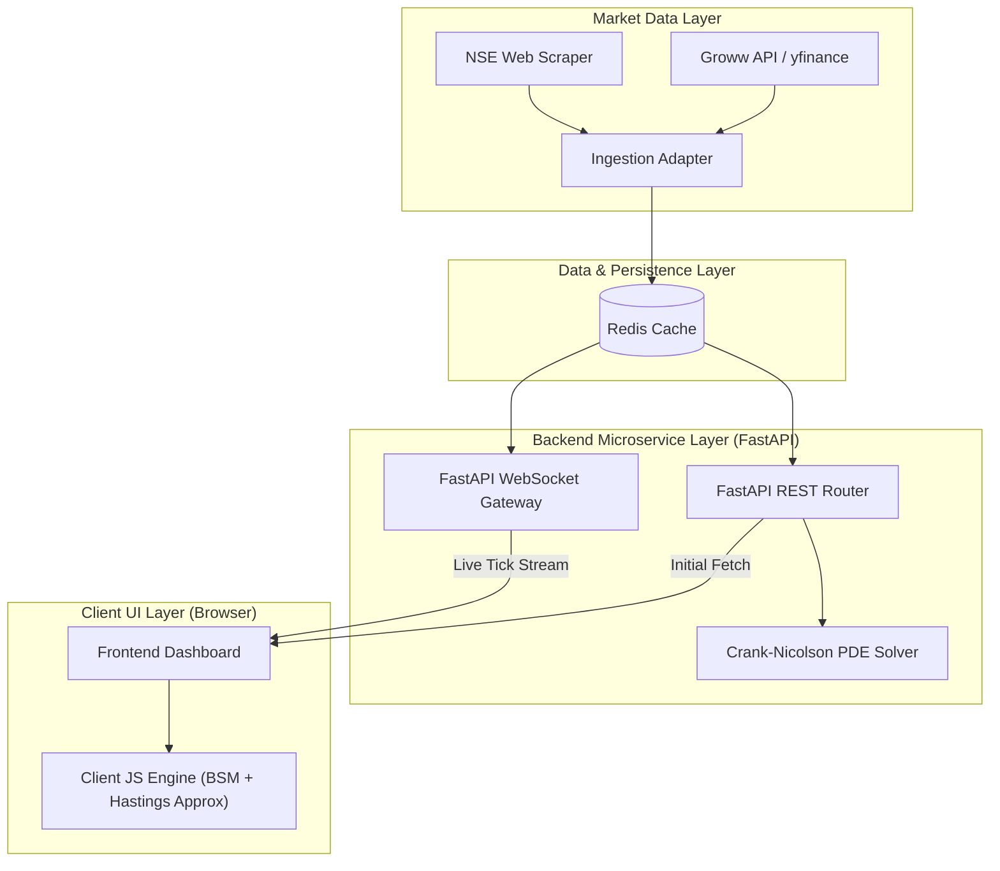
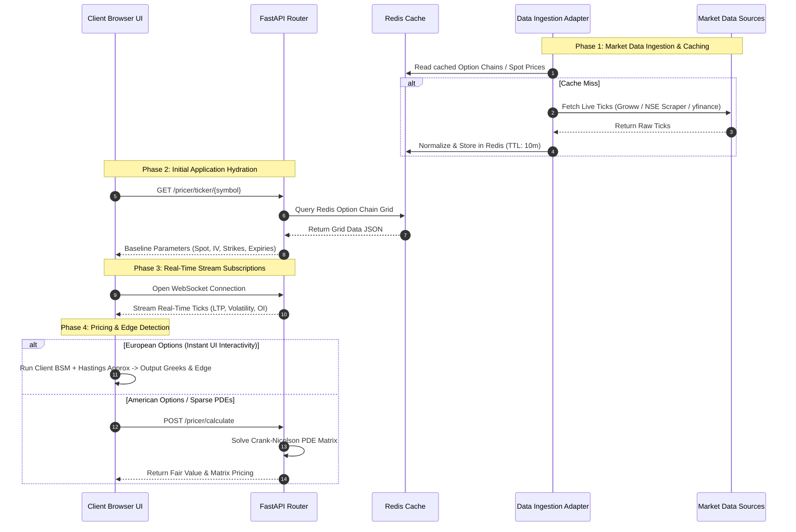

# AlphaStreams V2: Interview Preparation Guide

This guide will help you showcase your **AlphaStreams V2 (Market Sentiment & Option Chain Analytics Engine)** project on your resume and during interviews. The project is highly complex, blending Software Architecture, Quantitative Finance, and Machine Learning, making it an exceptional portfolio piece.

---

## 1. Resume Bullet Points

Tailor these bullets based on the specific role you are applying for (e.g., Backend Developer, Data Engineer, Quant Developer, or ML Engineer). Choose 3-4 bullet points that best fit your target role.

### **Option A: Software Engineering / Backend Focus**
* **Architected a high-throughput options analytics engine** using FastAPI, Domain-Driven Design (DDD), and Hexagonal Architecture to decouple domains and manage real-time financial data pipelines.
* **Built an asynchronous, event-driven data pipeline** utilizing Redis Streams and Celery to process live market data, seamlessly handling ingestion, dead-letter queues, and pub/sub WebSocket broadcasting to a vanilla JS frontend.
* **Implemented resilient external API integrations** with stateful session management, automatic cookie rotation, and a tiered fallback chain (Groww API → NSE Scraper → yfinance) to ensure zero-downtime market data feeds.
* **Engineered a scalable data storage layer** using PostgreSQL and TimescaleDB hypertables with automated retention policies to efficiently manage high-frequency tick data.
* **Containerized the application** using Docker and Supervisord to orchestrate concurrent backend processes (FastAPI, Postgres, Redis, Celery workers, ML orchestrators) within a single deployment environment.

### **Option B: Quantitative / Mathematical Developer Focus**
* **Developed a dual-engine live options pricing framework** executing analytical European Black-Scholes-Merton (BSM) models on the client and discretized Crank-Nicolson Partial Differential Equation (PDE) solvers on the backend.
* **Optimized client-side option pricing in pure JavaScript** using the **Hastings Approximation algorithm** for the cumulative normal distribution function ($N(x)$), delivering zero-latency Greek recalculations ($\Delta, \Gamma, \nu, \Theta, \rho$) directly in the user browser.
* **Optimized backend PDE numerical computations** by pre-factorizing the tridiagonal matrix $A$ using SciPy's SuperLU direct solver (`splu`) outside the temporal loop, reducing backward sweep iteration solves to linear $O(M)$ time for early-exercise American options.

### **Option C: Machine Learning / Data Science Focus**
* **Designed a multi-timeframe CNN-LSTM deep learning model** in PyTorch to forecast multi-day volatility trends, utilizing 22 engineered technical and macroeconomic features across daily, weekly, and monthly time horizons.
* **Integrated FinBERT and custom PyTorch models** for real-time news scoring and volatility predictions, isolating blocking neural network execution using thread pool executors (`ThreadPoolExecutor` and `asyncio.to_thread`) to preserve FastAPI event loop responsiveness.
* **Built a real-time data ingestion and aggregation pipeline** merging market tick data with alternative data (news sentiment, macro indicators) to power predictive models.

---

## 2. Standard Project Explanation & Pitch

### **The Elevator Pitch (Core Concept)**
> "Alpha Streams is an event-driven analytical microservice platform built to calculate fair option prices using the Black-Scholes-Merton formula for the Indian stock market.
> 
> An option is a financial contract. For example, if a user looks at a call option for a stock like HDFC trading at a spot price of ₹500 with a strike price of ₹521, this European-style contract gives the user the right to buy the stock at ₹521 upon expiry.
> 
> Alpha Streams ingests real-time market data to compute the mathematical 'fair price' of this contract via BSM. By comparing our theoretical price against the actual Last Traded Price (LTP) in the market, the platform instantly highlights the theoretical edge—identifying whether the option is underpriced (a potential buying opportunity) or overpriced."

---

### **How the System Works (Working of the Project)**
> "To power this, we implemented a highly resilient, event-driven microservice architecture divided into distinct domains.
> 
> The first is the data ingestion stream. To guarantee reliability and zero downtime, we established a tiered ingestion fallback chain—primary Groww API, secondary NSE web scraper, and Yahoo Finance. Our Celery background workers continuously harvest market data and store it in a Redis cache.
> 
> To deliver this data to the client with minimal latency, the frontend utilizes a two-step pipeline. On initial load, it performs a REST API request to retrieve baseline parameters (spot price, implied volatility, risk-free rate, dividend yield, and full option chain grid). Immediately following, it opens a live WebSocket connection to stream real-time updates for spot prices, option LTPs, implied volatility, volume, and open interest directly to the UI.
> 
> Once data reaches the client, calculation is dispatched via a dual-engine architecture:
> 
> 1. **Client-Side Analytical Engine**: For peak performance, the standard Black-Scholes-Merton European option formula runs directly in the browser via JavaScript. To evaluate the cumulative normal distribution function efficiently in JS without heavy libraries, we implemented the **Hastings approximation algorithm**. This eliminates backend latency for instant fair-value outputs, real-time Greek computations ($\Delta, \Gamma, \nu, \Theta, \rho$), and interactive slider adjustments.
> 
> 2. **Backend Numerical PDE Engine**: For complex options, we built a backend solver using the **Crank-Nicolson finite-difference scheme** backed by sparse matrix computations. While computationally heavier than analytical BSM, this numerical solver accurately prices American-style options (accounting for early exercise features), dynamic volatility term structures, and discrete dividends."

---

## 3. High-Level Architecture & Flow

### End-to-End Sequence Flow

---

## 4. Potential Interview Questions & Answers

### Architecture & System Design
**Q: Why did you choose Hexagonal Architecture / Domain-Driven Design (DDD)?**
* **A:** I used DDD to strictly separate concerns. Financial ingestion APIs, complex mathematical analytics, and the web layer all scale and evolve differently. By using ports and adapters, I decoupled the business logic (like option pricing) from the infrastructure (like Groww/NSE APIs or TimescaleDB). If I want to swap data providers, I only write a new adapter without touching the core math engine.

**Q: How did you handle real-time data streaming without crashing the application?**
* **A:** I implemented an event-driven architecture using **Redis Streams**. The ingestion tasks publish raw data to a stream, which is durably consumed by pricing and ML subscribers. Once processed, the data is pushed to a Redis Pub/Sub channel, and the FastAPI application broadcasts it to the frontend via WebSockets. I also implemented Dead-Letter Queues (DLQ) to catch and isolate failed processing events so they don't starve the consumer groups.

### Real-Time Data & Resilience
**Q: What happens if external market APIs go down?**
* **A:** We use a strict hierarchical failover adapter strategy (Groww API → NSE Webscraper → Yahoo Finance). If data cannot be retrieved across all providers, the system fails fast with a 503 Service Unavailable error rather than serving false synthetic data.

### Quantitative & Mathematical Modeling
**Q: Why did you implement both Black-Scholes and Crank-Nicolson PDE?**
* **A:** Black-Scholes provides a fast, closed-form analytical solution perfect for standard European options and quick client-side Greek calculations using the Hastings approximation in JavaScript. However, to handle more complex scenarios (like early exercise in American options or dynamic discrete dividends), numerical methods are required. The Crank-Nicolson method is an unconditionally stable finite difference method that provides high accuracy by discretizing the asset price and time into a grid and solving the resulting tridiagonal matrix using SciPy's sparse matrix solvers. 

**Q: How did you optimize the Crank-Nicolson PDE pricing computations?**
* **A:** Since the Crank-Nicolson spatial operator matrix $\mathbf{A}$ is time-invariant and static, performing a full sparse LU factorization (`spsolve`) inside the backwards temporal loop is extremely inefficient. I optimized this by pre-factorizing $\mathbf{A}$ outside the loop using SciPy's SuperLU direct solver (`splu`). Inside the loop, it now solves in linear $O(M)$ complexity using `A_solver.solve(rhs)`. This shifted the algorithm from $O(N \cdot \text{factorization})$ to a single factorization and $N$ back-solves, significantly speeding up pricing throughput.
