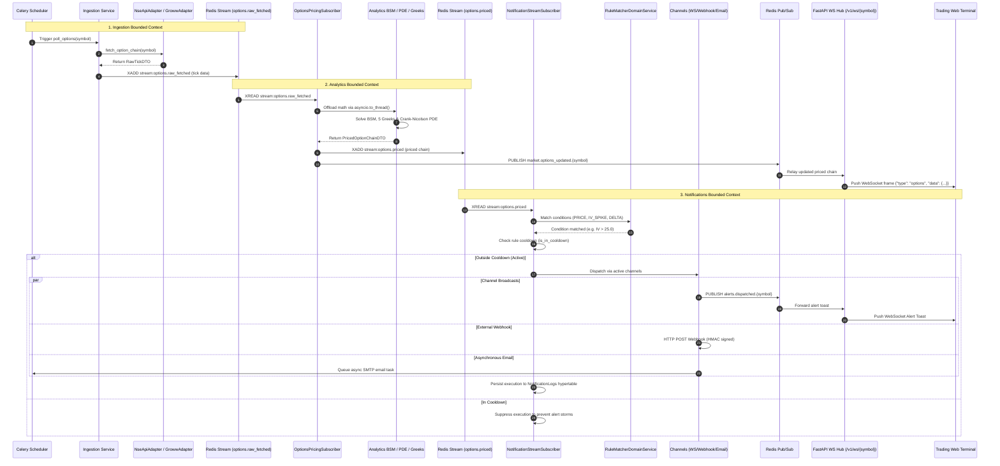

# 📈 AlphaStreams - Ultimate Quantitative Analytics & Interview Mastery Guide

> [!IMPORTANT]
> **COMPREHENSIVE MASTER INTERVIEW RESOURCE**  
> This guide contains the complete, battle-tested architectural, mathematical, and implementation details of **AlphaStreams V2**. It bridges theoretical financial engineering (Black-Scholes-Merton, Crank-Nicolson PDE solvers) with production backend systems (FastAPI, Redis Streams/Pub/Sub, TimescaleDB, Hexagonal Architecture, Multi-Channel Notifications). Use this document to master every line of code, design trade-off, and edge-case response for technical interviews.

---

## 1. RESUME SNIPPETS & 30-SECOND DEFENSES

### LaTeX Code for Resume
```latex
\resumeProject
  {AlphaStreams --- Real-Time Quant Analytics & Option Pricing Engine}
  {Python, FastAPI, Redis Streams, TimescaleDB (PostgreSQL), Celery, Docker}
  {June 2026}
  {}
  \resumeItemListStart
    \item {Architected a modular monolith using Domain-Driven Design (DDD) and Hexagonal Architecture in FastAPI, isolating Ingestion, Analytics, Notifications, and Historical OHLC bounded contexts via strict Ports and Adapters interfaces.}
    \item {Engineered an asynchronous options pricing pipeline with Redis Streams and background workers, solving European option fair values and 5 sensitivity Greeks ($\Delta, \Gamma, \nu, \Theta, \rho$) via analytical Black-Scholes-Merton and numerical Crank-Nicolson PDE schemes with SuperLU sparse matrix factorization.}
    \item {Built a real-time event-driven alert engine consuming processed tick streams, evaluating user-defined trigger conditions (Price, IV spikes, Delta limits) with atomic cooldown policies and multi-channel dispatch (WebSockets, HMAC Webhooks, Celery Email).}
    \item {Constructed a low-latency analytics gateway via WebSockets and Redis Pub/Sub, persisting time-series data across partitioned TimescaleDB hypertables with automated chunk retention (7-day ticks, 14-day alert logs, 90-day OHLC bars).}
    \item {Implemented multi-tenant persistent watchlists and profile state using Supabase PostgreSQL with Row Level Security (RLS) policies and Google OAuth authentication.}
  \resumeItemListEnd
```

### Microscopic Line-by-Line Resume Defense

| Bullet Concept | What It Means Technically | Exact Interview Response |
|---|---|---|
| **Modular Monolith & Bounded Context Split** | Decoupling domain logic into isolated packages (`domains/ingestion`, `domains/analytics`, `domains/notifications`, `domains/historical`) communicating strictly via abstract input/output interfaces (Ports) and durable event streams (`stream:options.raw_fetched`, `stream:options.priced`). | *"I organized the project as a Modular Monolith following Hexagonal Architecture across distinct bounded contexts: Ingestion, Analytics, Notifications, and Historical data. Business math logic never touches HTTP requests or database code directly. Instead, domain interfaces (`IOptionChainSourcePort`, `IAlertRuleRepositoryPort`) let us swap external market providers or persistence engines without altering core pricing formulas."* |
| **Async Pipeline (Redis Streams & Celery)** | Decoupling data retrieval from computationally heavy pricing algorithms using a durable, append-only log (`stream:options.raw_fetched`). | *"Celery Beat polls raw option chains asynchronously from external market adapters and publishes them to a Redis Stream. A background consumer daemon (`OptionsPricingSubscriber`) picks up raw tick frames, executes options pricing math off the HTTP event loop, and pushes processed events down the stream."* |
| **Crank-Nicolson PDE & SuperLU Factorization** | A second-order implicit-explicit finite difference scheme solving the Black-Scholes partial differential equation over an $M \times N$ spatial/temporal grid using pre-factorized sparse matrices (`scipy.sparse.linalg.splu`). | *"To price options where closed-form solutions are insufficient, I implemented a Crank-Nicolson PDE scheme. We discretize price and time onto a grid and factorize the implicit tridiagonal coefficient matrix $\mathbf{A}$ using SuperLU outside the time loop, reducing per-timestep evaluation time to $O(M)$."* |
| **Real-Time Notification Engine & Multi-Channel Dispatch** | An autonomous consumer daemon (`NotificationStreamSubscriber`) evaluating price, IV spike, and Delta threshold rules against live market streams, enforcing cooldown periods and dispatching via WebSockets, Webhooks, and Email. | *"The notifications domain listens to the priced options stream (`stream:options.priced`). When a tick matches user criteria, `EvaluateAlertsService` validates rule cooldowns to prevent alert storms and fans out notifications via WebSocket toasts (`alerts.dispatched.{symbol}`), signed HTTP webhooks, or asynchronous Celery SMTP emails."* |
| **TimescaleDB Hypertables & Multi-Tier Retention** | Time-partitioned PostgreSQL tables optimized for high-frequency write ingestion and time-range queries, paired with automated table chunk purging across multiple domains. | *"Time-series data is persisted in TimescaleDB hypertables partitioned into 1-day chunks. We enforce automated data lifecycle policies: 7-day retention for raw ticks (`TickData`), 14-day retention for alert audit records (`NotificationLogs`), and 90-day retention for historical candle bars (`OhlcCandles`), avoiding expensive SQL `DELETE` table locks."* |
| **WebSockets + Redis Pub/Sub Gateway** | Low-latency bi-directional streaming pushing processed option chain JSON frames to web browsers with sub-50ms latency. | *"When option chains are priced, workers publish to Redis Pub/Sub (`market.options_updated.{symbol}`). FastAPI WebSocket connections listening to the pub/sub channel immediately relay payloads to client dashboards, while a client-side Hastings polynomial normal CDF simulator enables instant zero-latency slider recalculations."* |

---

## 2. HIGH-LEVEL (HLD) & LOW-LEVEL DESIGN (LLD) ARCHITECTURE

### System Architecture Flow Diagram (HLD)

```
┌──────────────────────────────────────────────────────────────────────────────────────────────────┐
│                                       EXTERNAL DATA LAYER                                        │
│  ┌───────────────────────────┐   ┌───────────────────────────┐   ┌────────────────────────────┐  │
│  │    Groww API (Primary)    │   │  NSE India (HTTP Scraper) │   │   yfinance (OHLC Quote)    │  │
│  └─────────────┬─────────────┘   └─────────────┬─────────────┘   └─────────────┬──────────────┘  │
└────────────────┼───────────────────────────────┼───────────────────────────────┼─────────────────┘
                 │                               │                               │
                 └───────────────────────┬───────┴───────────────────────────────┘
                                         │ (HTTP / 10-Min Session Cookie Warmup)
┌────────────────────────────────────────┼─────────────────────────────────────────────────────────┐
│ 1. INGESTION BOUNDED CONTEXT (`domains/ingestion`)                                               │
│  ┌────────────────────────────────────────────────────────────────────────────────────────────┐  │
│  │                              AdapterFactory                                                │  │
│  │             ┌──────────────────────────────┴──────────────────────────────┐                │  │
│  │             ▼                                                             ▼                │  │
│  │    [ GrowwApiAdapter ]                                           [ NseApiAdapter ]         │  │
│  │   (Dynamic OAuth Header)                                  (Active 10-min Cookie Rotation)  │  │
│  └────────────────────────────────────────────┬───────────────────────────────────────────────┘  │
│                                               │                                                  │
│                                               ▼                                                  │
│                               [ IngestionService Orchestrator ]                                  │
│                                 (Celery Scheduled Ingestion)                                     │
└───────────────────────────────────────────────┬──────────────────────────────────────────────────┘
                                                │
                                                │ (Publish Raw Option Ticks)
                                                ▼
┌──────────────────────────────────────────────────────────────────────────────────────────────────┐
│ MESSAGING & STREAMING LAYER (REDIS)                                                              │
│  ┌────────────────────────────────────────────────────────────────────────────────────────────┐  │
│  │  Redis Stream: `stream:options.raw_fetched` (Durable Append-Only Log)                      │  │
│  └────────────────────────────────────────────┬───────────────────────────────────────────────┘  │
└───────────────────────────────────────────────┼──────────────────────────────────────────────────┘
                                                │
                                                │ (Consume Raw Ticks)
                                                ▼
┌──────────────────────────────────────────────────────────────────────────────────────────────────┐
│ 2. ANALYTICS BOUNDED CONTEXT (`domains/analytics` - Quantitative Math Engine)                    │
│  ┌────────────────────────────────────────────────────────────────────────────────────────────┐  │
│  │                           OptionsPricingSubscriber Daemon                                  │  │
│  │              (Executes in background thread pool via asyncio.to_thread)                    │  │
│  │                                                                                            │  │
│  │   ┌─────────────────────────────────────────┐    ┌──────────────────────────────────────┐  │  │
│  │   │  Black-Scholes Analytical Engine (BSM)  │    │  Crank-Nicolson PDE Numerical Solver │  │  │
│  │   │   - Exact Fair Call / Put Price         │    │   - Spatial & Temporal Grid ($M, N$) │  │  │
│  │   │   - 5 Dynamic Greeks ($\Delta, \Gamma, \nu, \Theta, \rho$)│    │   - SuperLU Sparse Matrix LU Factor  │  │  │
│  │   │   - Continuous Dividend Yield ($q$)     │    │   - CFL Dynamic Stability Guard      │  │  │
│  │   └─────────────────────────────────────────┘    └──────────────────────────────────────┘  │  │
│  │                                                                                            │  │
│  │   ┌────────────────────────────────────────────────────────────────────────────────────┐   │  │
│  │   │  Technical Indicators Engine (Vectorized RSI, MACD, EMA, Bollinger Bands, Pivots)  │   │  │
│  │   └────────────────────────────────────────────────────────────────────────────────────┘   │  │
│  └────────────────────────────────────────────┬───────────────────────────────────────────────┘  │
└───────────────────────────────────────────────┼──────────────────────────────────────────────────┘
                                                │
                     ┌──────────────────────────┴──────────────────────────┐
                     │ (Publish Priced Stream)                             │ (Broadcast Option Updates)
                     ▼                                                     ▼
┌──────────────────────────────────────────────────┐  ┌────────────────────────────────────────────┐
│ 3. NOTIFICATIONS CONTEXT (`domains/notifications`) │  │ REDIS PUB/SUB & CACHE INFRASTRUCTURE       │
│  ┌────────────────────────────────────────────┐  │  │  ┌──────────────────────────────────────┐  │
│  │      NotificationStreamSubscriber          │  │  │  │ Redis Key: `market:options:priced`   │  │
│  │   (Listens to `stream:options.priced`)     │  │  │  └──────────────────────────────────────┘  │
│  └─────────────────────┬──────────────────────┘  │  │  ┌──────────────────────────────────────┐  │
│                        ▼                         │  │  │ Pub/Sub: `market.options_updated`    │  │
│  ┌────────────────────────────────────────────┐  │  │  │ Pub/Sub: `market.price_updated`      │  │
│  │         EvaluateAlertsService              │  │  │  │ Pub/Sub: `alerts.dispatched`        │  │
│  │  - RuleMatcher (PRICE, IV, DELTA)          │  │  │  └──────────────────┬───────────────────┘  │
│  │  - Cooldown Enforcement (Atomic Check)     │  │  └─────────────────────┼──────────────────────┘
│  └─────────────────────┬──────────────────────┘                           │
│                        ▼                                                  │
│  ┌────────────────────────────────────────────┐                           │
│  │          Multi-Channel Dispatch            │                           │
│  │  - WebSocket Toast (`alerts.dispatched`)   │                           │
│  │  - Webhook POST (HMAC Signed + Retry)      │                           │
│  │  - Celery Email (SMTP Dispatcher)          │                           │
│  └─────────────────────┬──────────────────────┘                           │
└────────────────────────┼──────────────────────────────────────────────────┼──────────────────────┘
                         │                                                  │
                         │ (Audit Execution)                                │
                         ▼                                                  ▼
┌──────────────────────────────────────────────────┐  ┌────────────────────────────────────────────┐
│ 4. HISTORICAL & PERSISTENCE (`domains/historical`)│  │ 5. APPLICATION & SERVING (`app/`, `frontend`)│
│  ┌────────────────────────────────────────────┐  │  │  ┌──────────────────────────────────────┐  │
│  │ TimescaleDB Hypertables (PostgreSQL)       │  │  │  │ FastAPI Uvicorn REST Routers         │  │
│  │  - `TickData` (7-Day Auto Retention)       │  │  │  │  - `/v1/pricer/ticker/{symbol}`      │  │
│  │  - `NotificationLogs` (14-Day Retention)   │  │  │  │  - `/v1/derivatives`, `/v1/technicals`│  │
│  │  - `OhlcCandles` (90-Day Retention)       │  │  │  │  - `/v1/alerts` (Alert Rule CRUD)    │  │
│  │  - `AlertRules` (Relational Table)         │  │  │  └──────────────────┬───────────────────┘  │
│  └────────────────────────────────────────────┘  │  │  ┌──────────────────┴───────────────────┐  │
└──────────────────────────────────────────────────┘  │  │ WebSocket Gateway (`/v1/ws/{symbol}`) │  │
                                                      │  └──────────────────┬───────────────────┘  │
                                                      └─────────────────────┼──────────────────────┘
                                                                            │ (WebSocket Frame Streaming)
                                                                            ▼
                                                      ┌────────────────────────────────────────────┐
                                                      │ CLIENT BROWSER / TRADING TERMINAL          │
                                                      │  - Glassmorphic UI Dashboard               │
                                                      │  - Hastings Normal CDF BSM Simulator (JS)  │
                                                      │  - Supabase Google OAuth & RLS Watchlists  │
                                                      └────────────────────────────────────────────┘
```

---

### Low-Level Design (LLD) Hexagonal Class Architecture

```mermaid
classDiagram
    %% Ingestion Bounded Context
    class IOptionChainSourcePort {
        <<interface>>
        +fetch_option_chain(symbol: str) OptionChainDTO
    }
    class IMarketPriceSourcePort {
        <<interface>>
        +fetch_spot_price(symbol: str) SpotPriceDTO
    }
    class IEventPublisherPort {
        <<interface>>
        +publish(stream_name: str, payload: dict) str
    }
    class GrowwApiAdapter {
        -str api_key
        -str cache_ttl
        +fetch_option_chain(symbol: str) OptionChainDTO
        +fetch_spot_price(symbol: str) SpotPriceDTO
    }
    class NseApiAdapter {
        -ClientSession session
        -datetime last_cookie_refresh
        +refresh_cookies()
        +fetch_option_chain(symbol: str) OptionChainDTO
        +fetch_spot_price(symbol: str) SpotPriceDTO
    }
    class IngestionService {
        -IOptionChainSourcePort option_fetcher
        -IMarketPriceSourcePort price_fetcher
        -IEventPublisherPort event_bus
        +ingest_options(symbol: str) bool
        +ingest_spot_price(symbol: str) bool
    }

    %% Analytics Bounded Context
    class BsmCalculatorDomainService {
        +calculate_greeks(S: float, K: float, T: float, r: float, sigma: float, q: float) GreeksDTO
        +solve_call(S: float, K: float, T: float, r: float, sigma: float, q: float) float
        +solve_put(S: float, K: float, T: float, r: float, sigma: float, q: float) float
    }
    class CrankNicolsonPDE {
        +float S0
        +float K
        +float T
        +float r
        +float sigma
        +int M
        +int N
        -float S_max
        -float dS
        -float dt
        +solve() float
    }
    class TechnicalIndicatorsEngine {
        +compute_rsi(prices: List[float], period: int) float
        +compute_macd(prices: List[float]) MACDDTO
        +compute_bollinger_bands(prices: List[float]) BBDTO
        +compute_pivots(high: float, low: float, close: float) PivotDTO
    }
    class OptionsPricingSubscriber {
        -Redis redis_client
        -BsmCalculatorDomainService bsm_engine
        +start_consuming()
        +process_raw_tick(payload: dict)
    }

    %% Notifications Bounded Context
    class IAlertRuleRepositoryPort {
        <<interface>>
        +save_rule(rule: AlertRule) AlertRule
        +get_active_rules_by_symbol(symbol: str) List[AlertRule]
        +update_last_triggered(rule_id: UUID, timestamp: datetime)
        +log_notification_event(event: NotificationEvent)
    }
    class INotificationChannelAdapterPort {
        <<interface>>
        +dispatch(event: NotificationEvent, rule: AlertRule) bool
    }
    class AlertRule {
        +UUID id
        +str symbol
        +ConditionType condition_type
        +float threshold
        +List[DeliveryChannel] channels
        +int cooldown_seconds
        +datetime last_triggered_at
        +bool is_active
        +is_in_cooldown(current_time: datetime) bool
    }
    class RuleMatcherDomainService {
        +match(rule: AlertRule, tick_payload: dict) Tuple[bool, float, str]
    }
    class EvaluateAlertsService {
        -IAlertRuleRepositoryPort repo
        -List[INotificationChannelAdapterPort] channels
        +evaluate_tick_event(symbol: str, tick_payload: dict) List[NotificationEvent]
    }
    class NotificationStreamSubscriber {
        -Redis redis
        -EvaluateAlertsService evaluator
        +start_consuming()
        +process_event(payload: dict)
    }
    class WebSocketNotificationChannelAdapter {
        +dispatch(event: NotificationEvent, rule: AlertRule) bool
    }
    class WebhookNotificationChannelAdapter {
        +dispatch(event: NotificationEvent, rule: AlertRule) bool
    }
    class EmailNotificationChannelAdapter {
        +dispatch(event: NotificationEvent, rule: AlertRule) bool
    }

    %% Historical OHLC Bounded Context
    class IOhlcRepositoryPort {
        <<interface>>
        +save_candle(candle: OhlcCandle)
        +get_candles(symbol: str, timeframe: str, limit: int) List[OhlcCandle]
    }
    class TimescaleOhlcRepository {
        -Pool db_pool
        +save_candle(candle: OhlcCandle)
        +get_candles(symbol: str, timeframe: str, limit: int) List[OhlcCandle]
    }

    %% Relationships
    IOptionChainSourcePort <|.. GrowwApiAdapter
    IOptionChainSourcePort <|.. NseApiAdapter
    IMarketPriceSourcePort <|.. GrowwApiAdapter
    IMarketPriceSourcePort <|.. NseApiAdapter
    IngestionService --> IOptionChainSourcePort
    IngestionService --> IMarketPriceSourcePort
    IngestionService --> IEventPublisherPort

    OptionsPricingSubscriber --> BsmCalculatorDomainService
    OptionsPricingSubscriber --> CrankNicolsonPDE
    OptionsPricingSubscriber --> TechnicalIndicatorsEngine

    INotificationChannelAdapterPort <|.. WebSocketNotificationChannelAdapter
    INotificationChannelAdapterPort <|.. WebhookNotificationChannelAdapter
    INotificationChannelAdapterPort <|.. EmailNotificationChannelAdapter
    EvaluateAlertsService --> IAlertRuleRepositoryPort
    EvaluateAlertsService --> INotificationChannelAdapterPort
    EvaluateAlertsService --> RuleMatcherDomainService
    NotificationStreamSubscriber --> EvaluateAlertsService

    IOhlcRepositoryPort <|.. TimescaleOhlcRepository
```



---

### Sequence Diagram: Multi-Domain Event-Driven Execution



---

## 3. DEEP ARCHITECTURE DECISIONS & GENUINE TRADE-OFFS

### 1. Modular Monolith vs. Microservices
* **Decision:** Built the platform as a single deployable process structured into isolated domain packages (`domains/ingestion`, `domains/analytics`, `domains/notifications`, `domains/historical`, `shared`).
* **Why:** Microservices introduce distributed transaction overhead, network serialization latency between calls, complex multi-repo deployment pipelines, and service mesh management. For a quantitative analytics platform processing high-frequency option chains on single or dual nodes, in-memory function calls and local event queues deliver sub-millisecond execution without inter-service network serialization penalties.
* **Trade-off:** If ingestion or math computing spikes CPU to 100%, it could starve the FastAPI HTTP server if not properly offloaded to separate worker threads/processes.
* **Mitigation:** Utilized multi-threading (`asyncio.to_thread`), Celery background task workers, and container process supervision via Docker/Supervisord.

### 2. Hexagonal Architecture (Ports & Adapters)
* **Decision:** Enforced clean separation where application core logic depends only on interfaces (Ports), while external APIs, databases, and message brokers implement those interfaces (Adapters).
* **Why:** Third-party financial data providers (like NSE India or Groww) frequently change endpoint structures, introduce rate limits, or suffer outages. By programming to `IOptionChainSourcePort`, we can swap data providers or mock them during unit tests without changing a single line of option pricing code.
* **Trade-off:** Adds abstraction overhead, requiring DTO transformations between external API responses and domain entities.
* **Mitigation:** Lightweight Pydantic models for fast validation and explicit DTO conversion.

### 3. Domain Decomposition: Splitting Ingestion, Analytics, Notifications, and Historical OHLC
* **Decision:** Explicitly separated the data pipeline into four independent bounded contexts:
  1. `domains/ingestion`: Pure HTTP/session management and raw data normalization.
  2. `domains/analytics`: Pure mathematical and financial engineering logic (BSM, PDE, Greeks, Technical Indicators).
  3. `domains/notifications`: User alert rules, real-time trigger evaluation, cooldown enforcement, and multi-channel delivery.
  4. `domains/historical`: Immutable OHLC candle persistence and 1m/5m/1d timeframe aggregation.
* **Why:** Coupling alert evaluation or historical aggregation inside the ingestion or pricing loop adds latency and violates the Single Responsibility Principle. If an external SMTP server hangs or an alert webhook fails, the options pricing loop and ingestion scheduler must continue unaffected.
* **Trade-off:** Requires asynchronous event streaming (`stream:options.raw_fetched` $\rightarrow$ `stream:options.priced`) to bridge domain boundaries.
* **Mitigation:** Redis Streams provide sub-millisecond decoupled communication with durable message acknowledgments (`XACK`).

### 4. Redis Streams + Pub/Sub vs. Apache Kafka / RabbitMQ
* **Decision:** Utilized Redis Streams for durable tick logging (`stream:options.raw_fetched`, `stream:options.priced`) and Redis Pub/Sub (`market.options_updated.{symbol}`, `alerts.dispatched.{symbol}`) for real-time WebSocket broadcasting.
* **Why:** Kafka requires ZooKeeper/KRaft clusters, high RAM overhead, and substantial DevOps maintenance. RabbitMQ is optimized for AMQP routing but lacks lightweight in-memory caching. Redis already serves as our high-speed RAM cache; leveraging its Streams and Pub/Sub primitives eliminated extra infrastructure dependencies.
* **Trade-off:** Redis Streams store data in RAM. Unbounded stream growth can cause Memory OOM crashes.
* **Mitigation:** Applied approximate length trimming (`maxlen=10000, approximate=True`) on stream additions (`XADD`) and configured TimescaleDB for persistent historical tick storage.

### 5. TimescaleDB Multi-Hypertables vs. InfluxDB / MongoDB
* **Decision:** Selected PostgreSQL with the TimescaleDB extension for time-series persistence across three separate hypertables:
  - `TickData`: High-frequency raw tick prices (7-day automated chunk retention).
  - `NotificationLogs`: Triggered alert audit history (14-day automated retention).
  - `OhlcCandles`: 1m/5m/1d aggregated bars (90-day automated retention).
* **Why:** Pure NoSQL databases (MongoDB) lack strict ACID guarantees and financial SQL analytical aggregations (`time_bucket()`, moving averages). Dedicated TSDBs (InfluxDB) introduce a second query language (Flux/InfluxQL) and don't integrate with relational user auth tables. TimescaleDB provides standard SQL, hypertable automatic partitioning, and native retention policies while preserving relational integrity for user accounts, alert rules, and watchlists.
* **Trade-off:** PostgreSQL writes can bottleneck if unindexed or unpartitioned under high concurrency.
* **Mitigation:** Hypertables partitioned into 1-day chunks (`chunk_time_interval => INTERVAL '1 day'`) with automated chunk drop policies.

### 6. Tiered Fallback Chain & Fail-Fast HTTP 503 vs. Synthetic Mocking
* **Decision:** Implemented a fallback chain (Redis Cache $\rightarrow$ Groww API $\rightarrow$ Secondary NSE Scraper). If all external data sources fail, the API returns a strict `HTTP 503 Service Unavailable`.
* **Why:** Mocking or synthesizing synthetic option chains during upstream outage corrupts financial calculations, generating misleading Greeks and false arbitrage signals. In financial software, delivering no data is far safer than delivering inaccurate theoretical values.
* **Trade-off:** Temporary loss of API availability during upstream data vendor outages.

---

## 4. MATHEMATICAL SOLVER MODULE (IN-DEPTH SPECS & DERIVATIONS)

### 1. Analytical Black-Scholes-Merton (BSM) Model & Options Greeks

#### Closed-Form Formulation with Continuous Dividend Yield ($q$)
The BSM continuous dividend model evaluates theoretical European options:

$$d_1 = \frac{\ln\left(\frac{S_0}{K}\right) + \left(r - q + \frac{\sigma^2}{2}\right)T}{\sigma\sqrt{T}}$$
$$d_2 = d_1 - \sigma\sqrt{T}$$

* **Call Fair Price ($C_{BSM}$):**
  $$C_{BSM} = S_0 e^{-q T} N(d_1) - K e^{-r T} N(d_2)$$
* **Put Fair Price ($P_{BSM}$):**
  $$P_{BSM} = K e^{-r T} N(-d_2) - S_0 e^{-q T} N(-d_1)$$

Where:
- $S_0$: Current spot price of underlying asset
- $K$: Strike price
- $T$: Time to expiration in years ($\max(T, 10^{-6})$ safety guard against division by zero)
- $r$: Risk-free interest rate (e.g. 0.065 for 6.5%)
- $q$: Continuous dividend yield
- $\sigma$: Implied volatility ($\max(\sigma, 10^{-6})$ safety guard)
- $N(x)$: Cumulative distribution function of standard normal distribution

#### The 5 Primary Options Greeks Formulas

1. **Delta ($\Delta$):** First derivative of option price with respect to spot price.
   $$\Delta_{Call} = e^{-q T} N(d_1), \quad \Delta_{Put} = -e^{-q T} N(-d_1)$$
2. **Gamma ($\Gamma$):** Second derivative of option price with respect to spot price (rate of change of Delta).
   $$\Gamma = \frac{e^{-q T} n(d_1)}{S_0 \sigma \sqrt{T}} \quad \text{where } n(x) = \frac{1}{\sqrt{2\pi}} e^{-\frac{x^2}{2}}$$
3. **Vega ($\nu$):** Sensitivity of option price to a 1% change in implied volatility.
   $$\nu = \frac{S_0 e^{-q T} \sqrt{T} n(d_1)}{100}$$
4. **Theta ($\Theta$):** Daily rate of time decay.
   $$\Theta_{Call} = \frac{-\frac{S_0 e^{-q T} n(d_1) \sigma}{2 \sqrt{T}} + q S_0 e^{-q T} N(d_1) - r K e^{-r T} N(d_2)}{365}$$
   $$\Theta_{Put} = \frac{-\frac{S_0 e^{-q T} n(d_1) \sigma}{2 \sqrt{T}} - q S_0 e^{-q T} N(-d_1) + r K e^{-r T} N(-d_2)}{365}$$
5. **Rho ($\rho$):** Sensitivity of option price to a 1% change in interest rate.
   $$\rho_{Call} = \frac{K T e^{-r T} N(d_2)}{100}, \quad \rho_{Put} = \frac{-K T e^{-r T} N(-d_2)}{100}$$

---

### 2. Numerical Crank-Nicolson Partial Differential Equation (PDE) Solver

#### The Black-Scholes PDE
The pricing equation for any derivative option $V(S, t)$ is governed by:

$$\frac{\partial V}{\partial t} + \frac{1}{2}\sigma^2 S^2 \frac{\partial^2 V}{\partial S^2} + r S \frac{\partial V}{\partial S} - r V = 0$$

#### Grid Discretization & Dynamic CFL Stability Guard
- **Price Domain:** $S \in [0, S_{max}]$ with $S_{max} = \max(3K, 2.5 S_0)$. Discretized into $M$ equal space steps: $dS = \frac{S_{max}}{M}$.
- **Time Domain:** $t \in [0, T]$. Discretized into $N$ equal time steps: $dt = \frac{T}{N}$.
- **CFL Stability Check:** To guarantee numerical stability when backward-stepping, $dt$ is dynamically validated against:
  $$dt_{max} = \frac{0.9}{\sigma^2 M^2} S_{max}^2$$
  If $dt > dt_{max}$, $N$ is automatically adjusted upwards: $N_{new} = \lfloor \frac{T}{dt_{max}} \rfloor + 1$.

#### Tridiagonal Linear System Construction
Crank-Nicolson averages implicit and explicit finite difference schemes:

$$\mathbf{A} \mathbf{V}^j = \mathbf{B} \mathbf{V}^{j+1}$$

For inner nodes $i \in [1, M-1]$:
$$\alpha_i = -\frac{1}{4} dt \left( \sigma^2 i^2 - r i \right)$$
$$\beta_i = \frac{1}{2} dt \left( \sigma^2 i^2 + r \right)$$
$$\gamma_i = -\frac{1}{4} dt \left( \sigma^2 i^2 + r i \right)$$

- **Matrix $\mathbf{A}$ (Implicit side - LHS):**
  Tridiagonal with lower diagonal $-\alpha[1:]$, main diagonal $1 - \beta$, upper diagonal $-\gamma[:-1]$.
- **Matrix $\mathbf{B}$ (Explicit side - RHS):**
  Tridiagonal with lower diagonal $\alpha[1:]$, main diagonal $1 + \beta$, upper diagonal $\gamma[:-1]$.

#### SuperLU Sparse Matrix Optimization & Boundary Conditions
1. **Pre-Factorization:** Since Matrix $\mathbf{A}$ depends only on grid steps ($M, N$) and static parameters ($\sigma, r$), $\mathbf{A}$ is converted to CSC format and factorized using SuperLU (`scipy.sparse.linalg.splu(A)`) **once** outside the time loop.
2. **Backward Time Loop:** Solves $\mathbf{A} \mathbf{V}^j = \mathbf{B} \mathbf{V}^{j+1}$ from terminal expiration $t=T$ down to $t=0$ in linear $O(M)$ time per step.
3. **Boundary Conditions:**
   - Call Option at $S=0$: $V(0, t) = 0$; at $S=S_{max}$: $V(S_{max}, t) = S_{max} - K e^{-r (T-t)}$.
   - Put Option at $S=0$: $V(0, t) = K e^{-r (T-t)}$; at $S=S_{max}$: $V(S_{max}, t) = 0$.
4. **Spatial Interpolation:** Linear interpolation (`np.interp(S0, S_nodes, grid)`) derives the exact option value corresponding to spot price $S_0$.

---

### 3. Technical Indicators Engine (`technical_indicators_engine.py` / `technicals_calculator.py`)

1. **Relative Strength Index (RSI - 14 Period):**
   $$RS = \frac{\text{Average Gain over 14 periods}}{\text{Average Loss over 14 periods}}, \quad RSI = 100 - \left( \frac{100}{1 + RS} \right)$$
   *Signals:* $RSI \ge 70 \rightarrow$ Overbought (Bearish); $RSI \le 30 \rightarrow$ Oversold (Bullish).
2. **Moving Averages (SMA & EMA):**
   - $SMA_N = \frac{\sum_{i=1}^{N} P_i}{N}$
   - $EMA_t = (P_t \times k) + (EMA_{t-1} \times (1 - k)) \quad \text{where } k = \frac{2}{N + 1}$
3. **Moving Average Convergence Divergence (MACD 12, 26, 9):**
   - $MACD\_Line = EMA_{12} - EMA_{26}$
   - $Signal\_Line = EMA_9(MACD\_Line)$
   - $Histogram = MACD\_Line - Signal\_Line$
4. **Bollinger Bands (20 Period, 2 StdDev):**
   - $Middle\_Band = SMA_{20}$
   - $Upper\_Band = SMA_{20} + (2 \times \sigma)$
   - $Lower\_Band = SMA_{20} - (2 \times \sigma)$
5. **Average True Range (ATR - 14 Period):**
   $$TR = \max\left( \text{High} - \text{Low}, |\text{High} - \text{Close}_{prev}|, |\text{Low} - \text{Close}_{prev}| \right), \quad ATR = \text{EMA}_{14}(TR)$$
6. **Classic Floor Pivot Points:**
   - $Pivot (P) = \frac{\text{High} + \text{Low} + \text{Close}}{3}$
   - $R_1 = (2 \times P) - \text{Low}, \quad S_1 = (2 \times P) - \text{High}$
   - $R_2 = P + (\text{High} - \text{Low}), \quad S_2 = P - (\text{High} - \text{Low})$

---

## 5. REAL ENGINEERING CHALLENGES FACED & CONCRETE SOLUTIONS

### Issue 1: NSE India Session Cookie Expiration & Anti-Scraping (HTTP 403 Forbidden)
* **Problem:** Direct calls to `nseindia.com/api/option-chain-indices` failed with HTTP 403 or empty JSON because NSE validates browser headers, cookies, and session lifecycle. Static HTTP clients were blocked within minutes.
* **Solution:** Developed `NseApiAdapter` with active session warm-up. On startup, the adapter hits `https://www.nseindia.com` to capture session cookies (`nsit`, `nseappid`). A background timer refreshes session cookies every 10 minutes (600s). In addition, requests spoof Chrome/Firefox User-Agent strings and set `Referer: https://www.nseindia.com/option-chain`.

### Issue 2: FastAPI Event Loop Blocking During Heavy PDE Calculations
* **Problem:** Executing Crank-Nicolson PDE grid backward loops for 50+ option strikes in the main thread blocked FastAPI's ASGI event loop, causing WebSocket ping/pong timeouts and spiking HTTP latency to >2000ms.
* **Solution:** Refactored strike calculation logic into pure synchronous functions (`_solve_strike_sync`) and dispatched them via `asyncio.to_thread()` / process worker pools. This delegated heavy NumPy/SciPy matrix operations to OS worker threads, keeping the FastAPI event loop under 5ms response latency.

### Issue 3: Stream-Driven Notifications Decoupling & Alert Storm Mitigation
* **Problem:** When high market volatility triggered rapid price and IV fluctuations, users received hundreds of duplicate alerts within seconds (alert storm), overloading downstream webhook endpoints and exhausting email SMTP rate limits.
* **Solution:** Decoupled notifications into an independent domain (`domains/notifications`) consuming `stream:options.priced`. Implemented atomic cooldown checks in `AlertRule.is_in_cooldown()` (default 300s). When triggered, the repository immediately updates `last_triggered_at` in PostgreSQL before dispatching via channels, suppressing duplicate alerts while persisting an immutable execution log to the `NotificationLogs` hypertable.

### Issue 4: Hypertable Disk Growth under High Tick Ingestion Frequency
* **Problem:** Storing tick updates for multiple index options every 5 seconds generated over 500,000 database rows per day, rapidly exhausting local container disk space.
* **Solution:** Configured TimescaleDB hypertables with 1-day chunk intervals (`chunk_time_interval => INTERVAL '1 day'`) and attached an automated retention policy (`SELECT add_retention_policy('TickData', INTERVAL '7 days');`). TimescaleDB drops entire underlying table file chunks instantly from disk without performing expensive row-by-row SQL `DELETE` operations.

### Issue 5: WebSocket Reconnections & Stale Client Sockets
* **Problem:** Network interruptions caused browser WebSocket clients to disconnect ungracefully, leaving orphaned socket listeners subscribing to Redis Pub/Sub and wasting RAM.
* **Solution:** Built a centralized `WebSocketManager` that handles client lifecycle events. Disconnections automatically unsubscribe from Redis Pub/Sub channels and remove socket objects from active memory sets. Client browsers execute an exponential backoff reconnect strategy with heartbeats every 15 seconds.

### Issue 6: Upstream Market Data Outages & Rate Limits
* **Problem:** Groww API rate-limits requests during high market volatility, returning `429 Too Many Requests`. Falling back to synthetic mock data caused inaccurate option pricing.
* **Solution:** Created an `AdapterFactory` implementing a multi-tiered fallback strategy: Redis Cache $\rightarrow$ Groww API $\rightarrow$ NSE Web Scraper. If all external providers fail, the system triggers a **Fail-Fast** error policy (`HTTP 503 Service Unavailable`), guaranteeing data integrity over false theoretical metrics.

---

## 6. MASTER INTERVIEW SCRIPTS

### The 2-Minute Elevator Pitch

> **Interviewer:** *"Can you tell me about AlphaStreams?"*

**Script:**
"AlphaStreams is a real-time quantitative analytics and derivative pricing engine designed to ingest live option chains from Indian financial markets, compute theoretical fair values and sensitivity Greeks using analytical Black-Scholes-Merton and numerical Crank-Nicolson PDE solvers, and stream sub-50ms market updates and automated alerts to an interactive trading terminal.

Architecturally, I engineered the system as a **Modular Monolith** using **FastAPI** and **Hexagonal Architecture (Ports and Adapters)** across four strictly isolated bounded contexts: **Ingestion**, **Analytics**, **Notifications**, and **Historical OHLC**.

Data ingestion is handled asynchronously via **Celery** tasks and an `AdapterFactory` supporting both Groww API and an automated NSE India scraper with dynamic 10-minute session cookie rotation. Raw market ticks are published to **Redis Streams** (`stream:options.raw_fetched`).

Our **Analytics** consumer daemon processes these stream events, offloads heavy PDE matrix computations to OS worker threads via `asyncio.to_thread`, and factorizes tridiagonal coefficient matrices with **SuperLU** in linear $O(M)$ time per step. Priced payloads are published to `stream:options.priced` and broadcasted over **Redis Pub/Sub** to active **WebSocket** clients.

A dedicated **Notifications** engine listens to the priced stream, evaluates real-time alert conditions (Price limits, IV spikes, Delta thresholds), enforces atomic cooldown periods to prevent alert storms, and dispatches notifications across WebSockets, signed Webhooks, and Celery SMTP emails.

For storage, we utilize **TimescaleDB hypertables** with automated chunk retention policies (7-day ticks, 14-day alert logs, 90-day OHLC bars), while user watchlists are secured with **Supabase PostgreSQL Row Level Security (RLS)**. The entire system is containerized with **Docker** and supervised via **Supervisord**."

---

### The 5-Minute Technical Deep-Dive

> **Interviewer:** *"Walk me through the architecture and design trade-offs of AlphaStreams."*

**Script:**
- **Minute 1: Architecture & Bounded Context Decomposition:**
  "I chose a Modular Monolith with Hexagonal Architecture over microservices to avoid distributed networking latency while keeping domain boundaries strictly isolated. The codebase is organized into four bounded contexts: Ingestion, Analytics, Notifications, and Historical OHLC. Communication across domains occurs exclusively through abstract Ports or durable Redis Streams."

- **Minute 2: Session Management & Ingestion Fallback:**
  "To bypass anti-scraping protections on NSE endpoints, our `NseApiAdapter` executes an automated session warm-up sequence capturing initial cookies (`nsit`, `nseappid`) and refreshes them every 10 minutes. If the primary Groww API rate-limits, our `AdapterFactory` falls back to the NSE scraper. If all sources fail, we enforce a Fail-Fast policy returning `HTTP 503 Service Unavailable` rather than corrupting mathematical pricing with synthetic mock data."

- **Minute 3: Mathematical Solver Engine & SuperLU PDE Optimization:**
  "For derivatives pricing, we implement both analytical BSM with continuous dividend yield ($q$) and a numerical Crank-Nicolson PDE solver. To evaluate the $M \times N$ finite-difference grid efficiently, we pre-factorize the implicit tridiagonal matrix $\mathbf{A}$ using SciPy's SuperLU direct solver (`splu`) outside the time loop. This reduces backward-step solving time from $O(M^3)$ to linear $O(M)$."

- **Minute 4: Asynchronous Streaming & Notifications Alert Engine:**
  "To keep the FastAPI ASGI event loop under 5ms latency, heavy PDE math is dispatched to OS worker threads via `asyncio.to_thread`. Processed option chains flow into `stream:options.priced`. Our `NotificationStreamSubscriber` daemon consumes this stream, matches user alert rules against live IV and Delta values, enforces atomic cooldown periods to suppress alert storms, and fans out alerts via WebSockets, HMAC-signed webhooks, and Celery emails."

- **Minute 5: Storage Optimization & Multi-Tenant Security:**
  "For persistent time-series data, we leverage TimescaleDB hypertables partitioned into 1-day chunks with multi-tier retention policies (7-day ticks, 14-day notification logs, 90-day OHLC candles) that drop physical file chunks instantly. User authentication and watchlists are managed via Supabase PostgreSQL with Row Level Security (`auth.uid() = user_id`), ensuring complete tenant isolation."

---

## 7. 30 HARD-HITTING INTERVIEW QUESTIONS & ANSWERS

### Q1: Why did you choose FastAPI over Flask or Django?
**Answer:** FastAPI built on Starlette and Pydantic provides native `async/await` support out of the box, making it significantly faster for concurrency-heavy applications like WebSocket connections. Django and Flask are WSGI-based (synchronous by default), requiring additional async wrappers or ASGI extensions. Furthermore, FastAPI automatically generates OpenAPI (Swagger) documentation and performs high-speed data validation via Pydantic.

### Q2: What is Hexagonal Architecture and why did you use it here?
**Answer:** Hexagonal Architecture (Ports and Adapters) separates core business logic from external dependencies (frameworks, databases, third-party APIs). Business logic depends only on abstract interfaces (Ports, like `IOptionChainSourcePort` or `IAlertRuleRepositoryPort`). External tools implement these interfaces (Adapters, like `GrowwApiAdapter` or `PostgresAlertRuleRepository`). We used it so that switching data providers or persistence engines requires zero modifications to the option pricing or rule matching domain engines.

### Q3: Why did you split Ingestion, Analytics, Notifications, and Historical into separate bounded contexts?
**Answer:** Each domain has distinct business lifecycles and performance characteristics:
1. **Ingestion:** Focuses on external API communication, rate limits, cookie rotation, and payload normalization.
2. **Analytics:** Focuses on pure CPU-bound mathematical modeling (BSM, PDE, Greeks, Technical Indicators).
3. **Notifications:** Focuses on rule matching, alert storm prevention (cooldowns), and multi-channel I/O dispatch.
4. **Historical:** Focuses on immutable candle bar persistence and timeframe queries.
Splitting them ensures that a failure in external email dispatch or web scraping never crashes option pricing or blocks WebSocket delivery.

### Q4: How do Redis Streams differ from Redis Pub/Sub?
**Answer:** 
- **Redis Pub/Sub** is a fire-and-forget message broker. If a subscriber is offline when a message is published, the message is lost forever. It is ideal for live, ephemeral WebSocket streaming.
- **Redis Streams** is an append-only, durable log data structure. It supports consumer groups, message acknowledgement (`XACK`), and replayability. If a worker process crashes, it can resume processing unacknowledged ticks from the stream upon restart.

### Q5: How does the Notifications engine prevent alert storms during extreme market volatility?
**Answer:** When market prices or IV spike rapidly, hundreds of ticks can match a user's alert condition within seconds. To prevent spamming users:
1. Each `AlertRule` has an atomic `cooldown_seconds` setting (default 300s).
2. The domain service checks `rule.is_in_cooldown(current_time)`.
3. If triggered, `update_last_triggered()` updates the rule's timestamp in PostgreSQL immediately before channel dispatch.
4. Subsequent ticks within the cooldown window are dropped by the rule matcher.

### Q6: Why use Crank-Nicolson instead of explicit or fully implicit finite difference schemes?
**Answer:**
- **Explicit Finite Difference** is conditionally stable and requires extremely tiny time steps ($dt \le \frac{1}{2} dS^2$) to avoid numerical explosion (CFL violation).
- **Implicit Finite Difference** is unconditionally stable, but only first-order accurate in time $O(dt)$.
- **Crank-Nicolson** averages implicit and explicit schemes. It is unconditionally stable and achieves second-order accuracy in both space and time $O(dt^2, dS^2)$, allowing larger time steps while maintaining high precision.

### Q7: How did you solve the tridiagonal matrix in Crank-Nicolson efficiently?
**Answer:** The discretized PDE yields a tridiagonal system $\mathbf{A} \mathbf{V}^j = \mathbf{B} \mathbf{V}^{j+1}$. Since Matrix $\mathbf{A}$ depends on static parameters ($\sigma, r, dt, dS$), we convert $\mathbf{A}$ into CSC sparse format and pre-factorize it using SciPy's SuperLU direct solver (`splu(A)`) **before** starting the backward time loop. During each time step, solving $\mathbf{A} \mathbf{V}^j = \text{rhs}$ requires only forward/backward substitution in $O(M)$ time instead of full matrix inversion $O(M^3)$.

### Q8: What is the CFL stability condition in your PDE solver?
**Answer:** The Courant-Friedrichs-Lewy (CFL) condition determines maximum time step thresholds to prevent numerical oscillations in finite difference schemes. In our solver, we enforce $dt \le \frac{0.9}{\sigma^2 M^2} S_{max}^2$. If the configured time step exceeds this threshold, the solver automatically increases the number of time steps $N$, shrinking $dt$ to guarantee convergence.

### Q9: How do you calculate Options Greeks?
**Answer:** Greeks are computed using analytical partial derivatives of the Black-Scholes-Merton continuous dividend formula:
- Delta ($\Delta$) is the first derivative with respect to spot price ($S_0$).
- Gamma ($\Gamma$) is the second derivative with respect to spot price.
- Vega ($\nu$) is the derivative with respect to volatility ($\sigma$).
- Theta ($\Theta$) is the derivative with respect to time ($T$).
- Rho ($\rho$) is the derivative with respect to interest rate ($r$).

### Q10: What happens if an external API fails during market hours?
**Answer:** The system executes a multi-tiered fallback policy via `AdapterFactory`:
1. Check Redis Cache (`market:options:{symbol}`).
2. Try Primary Provider (`GrowwApiAdapter`).
3. Fallback to Secondary Scraper (`NseApiAdapter`).
4. If all fail, return `HTTP 503 Service Unavailable`. We explicitly avoid mock data to protect downstream analytics from false price signals.

### Q11: How do you handle NSE India cookie rotation?
**Answer:** NSE requires active session cookies (`nsit`, `nseappid`). Our `NseApiAdapter` executes an initial GET request to `https://www.nseindia.com` during bootstrap to extract session cookies into an `aiohttp` ClientSession. A background asyncio task refreshes these cookies every 10 minutes (600 seconds) while spoofing browser user-agents and referer headers.

### Q12: How does TimescaleDB optimize time-series queries over vanilla PostgreSQL?
**Answer:** TimescaleDB automatically partitions PostgreSQL tables into physical sub-tables called **hypertables** based on time intervals (e.g. 1-day chunks). Queries filtering by timestamp only scan relevant chunks instead of indexing multi-gigabyte monolithic tables. Furthermore, dropping old data chunks via `drop_chunks()` deletes physical disk files instantly rather than running slow SQL `DELETE` queries that generate WAL logs and fragmentation.

### Q13: What is Row Level Security (RLS) in PostgreSQL/Supabase?
**Answer:** RLS allows database administrators to define security policies at the table level that restrict which rows a user can SELECT, INSERT, UPDATE, or DELETE based on their authenticated user ID (`auth.uid()`). In AlphaStreams, watchlists use the policy `USING (auth.uid() = user_id)`, ensuring users can only read and modify their own watchlists even if connected via public API keys.

### Q14: Why run heavy computations in `asyncio.to_thread` instead of directly in an async function?
**Answer:** Async functions in Python use cooperative multitasking on a single event loop thread. CPU-bound operations (like NumPy array manipulations or SciPy LU solves) do not yield control back to the event loop via `await`. Executing heavy math inside an async function blocks the entire thread, halting all incoming HTTP requests and WebSocket frames. `asyncio.to_thread()` offloads the computation to a separate OS thread pool, freeing the main event loop.

### Q15: How does the WebSocket gateway handle client disconnections?
**Answer:** FastAPI WebSocket connections are managed by a centralized `WebSocketManager`. When a client closes the socket or drops connection:
1. The socket connection is removed from the active connection registry.
2. If no active clients remain for a symbol, the manager unsubscribes from the corresponding Redis Pub/Sub channel to conserve network bandwidth and RAM.

### Q16: How do you compute technical indicators like RSI and MACD?
**Answer:** `technical_indicators_engine.py` processes raw close price series:
- RSI calculates 14-period average gains vs average losses, outputting a value between 0 and 100.
- MACD subtracts the 26-period EMA from the 12-period EMA to form the MACD line, then computes a 9-period EMA signal line and histogram.
- Bollinger Bands generate upper and lower standard deviation bounds ($\pm 2\sigma$) around a 20-period SMA.
- ATR calculates a 14-period EMA of true range values.
- Classic Floor Pivots derive $P, R_1, S_1, R_2, S_2$ from previous High, Low, and Close prices.

### Q17: How does the client-side browser BSM simulator work without backend API calls?
**Answer:** The frontend SPA contains a JavaScript implementation of Hastings' polynomial approximation for the Cumulative Normal Distribution ($N(x)$). When a user adjusts spot price or implied volatility sliders on the UI, the browser executes the Hastings algorithm in local JavaScript, rendering theoretical option prices instantly with 0ms server latency.

### Q18: How do you prevent deadlocks and lost messages in Redis Stream processing?
**Answer:** Consumer groups use explicit message acknowledgment (`XACK`). If a worker crashes mid-processing, unacknowledged messages remain in the Pending Entries List (PEL). A background janitor task checks for pending messages exceeding 60 seconds of processing time and claims them (`XCLAIM`) for retry. If a message fails 3 times, it is moved to a Dead-Letter Queue stream (`stream:dlq:refresh_request`).

### Q19: What is continuous dividend yield ($q$) in Black-Scholes?
**Answer:** In stock index options (like NIFTY 50), underlying stocks pay dividends over time. Continuous dividend yield ($q$) reduces the growth rate of the spot price from $r$ to $(r - q)$, lowering call option prices and increasing put option prices:
$$C = S_0 e^{-q T} N(d_1) - K e^{-r T} N(d_2)$$

### Q20: What is implied volatility (IV) and how is it used in your system?
**Answer:** Implied Volatility is the market's forward-looking expectation of asset volatility derived from live option market prices. We extract IV directly from option chain feeds (or solve for it using Newton-Raphson inversion) and pass it into our BSM and PDE solvers to calculate fair model values and Greeks.

### Q21: Why use Celery instead of standard background asyncio tasks for ingestion?
**Answer:** Asyncio background tasks run within the FastAPI web process. If the web server restarts or crashes, active background tasks are killed. Celery uses external message queues (Redis) and standalone worker processes, providing distributed task scheduling, task retry mechanisms, and isolation from the web server process lifecycle.

### Q22: How do you secure REST endpoints and WebSockets in FastAPI?
**Answer:** OAuth2 JWT tokens issued by Supabase Auth are validated via custom FastAPI dependency injection middleware (`get_current_user`). For WebSockets, the JWT access token is passed via query parameter (`/v1/ws/{symbol}?token=...`) and validated during the initial ASGI HTTP upgrade handshake before accepting the connection.

### Q23: What is the computational complexity of your BSM vs PDE solver?
**Answer:**
- **BSM Solver:** $O(1)$ constant time complexity per strike (evaluates elementary math functions and normal CDF).
- **Crank-Nicolson PDE Solver:** $O(M \times N)$ time complexity for an $M \times N$ grid. With pre-factorized SuperLU sparse matrices, each time step requires $O(M)$ operations, yielding total execution time $O(M \cdot N)$.

### Q24: How do you containerize the application for local and cloud deployment?
**Answer:** We build a multi-stage Docker image based on `python:3.11-slim`. A `supervisord` configuration manages process execution inside the container (FastAPI ASGI server, Celery ingestion worker, Options subscriber daemon, and Notification subscriber daemon). Environment variables control service endpoints (`REDIS_URL`, `DATABASE_URL`).

### Q25: How do you prevent SQL injection and dynamic query vulnerability?
**Answer:** All database operations utilize parameterized async SQL queries via `asyncpg` or SQLAlchemy ORM models. Inputs are validated and sanitized by Pydantic models before reaching repository layers.

### Q26: What is the purpose of the Shared Kernel in your domain design?
**Answer:** The Shared Kernel (`shared/`) contains cross-cutting code used by all domain bounded contexts without creating circular dependencies. This includes Redis connection pool singletons, database pool helpers, global stream constants, symbol validation rules, custom exception classes, and structured logging configurations.

### Q27: How does webhook notification delivery guarantee security and resilience?
**Answer:** The `WebhookNotificationChannelAdapter` constructs a SHA-256 HMAC signature using a shared secret header (`X-AlphaStreams-Signature`), allowing receiving webhooks to verify payload authenticity. Webhook dispatches are executed with configurable timeouts (5s) and automatic exponential backoff retries.

### Q28: How are historical OHLC candles stored and queried?
**Answer:** The `domains/historical` context provides `TimescaleOhlcRepository` implementing `IOhlcRepositoryPort`. It persists 1m, 5m, and 1d candlestick aggregates into the `OhlcCandles` hypertable. Solvers query historical candles to calculate rolling ATR, Bollinger Bands, and moving averages.

### Q29: What is the fail-fast policy in your market data architecture?
**Answer:** If all external market adapters (Groww and NSE) fail and no cached data exists, the application immediately returns `HTTP 503 Service Unavailable`. We strictly reject generating synthetic mock prices because inaccurate option prices would generate false Greeks and dangerous trading signals.

### Q30: How would you scale AlphaStreams to handle 100,000 concurrent users?
**Answer:**
1. **Stateless Web Layer:** Deploy multiple FastAPI container instances behind an NGINX or AWS ALB load balancer.
2. **Distributed WebSocket Hub:** Use Redis Pub/Sub as a multi-node message broker so any FastAPI instance can relay live updates to connected sockets.
3. **Dedicated Worker Clusters:** Scale Celery worker instances independently on Kubernetes (HPA) to process high-frequency option chains.
4. **Database Read Replicas:** Use TimescaleDB read replicas for heavy historical analytical queries while directing write streams to the primary database instance.

---

## 8. ESSENTIAL PREREQUISITE KNOWLEDGE CHEATSHEET

To fully understand, articulate, and defend **AlphaStreams V2** in a technical interview, an engineer must grasp foundational concepts across 8 core domains:

### 1. Financial Derivatives & Options Fundamentals
- **Call vs. Put Options**: A Call option grants the holder the right to BUY an underlying asset at strike price $K$; a Put option grants the right to SELL at $K$.
- **Option Moneyness**: Categorizes options based on current spot price ($S_0$) vs. strike ($K$):
  - *In-the-Money (ITM)*: Call ($S_0 > K$), Put ($S_0 < K$) — Has intrinsic value.
  - *At-the-Money (ATM)*: Call & Put ($S_0 \approx K$).
  - *Out-of-the-Money (OTM)*: Call ($S_0 < K$), Put ($S_0 > K$) — Zero intrinsic value, pure time value.
- **Intrinsic Value vs. Time Value**: Total Option Premium = Intrinsic Value + Time Value. As time to expiration approaches zero ($T \rightarrow 0$), time value decays to 0 (Theta decay).
- **Implied Volatility (IV)**: The market's forward-looking estimate of asset price volatility embedded in live option premiums. Higher IV increases both Call and Put option prices.

### 2. Asynchronous Python & Concurrency Model
- **ASGI vs. WSGI**: WSGI (Flask/Django) is synchronous (1 request per OS thread). ASGI (FastAPI/Starlette) uses asynchronous event loops to handle thousands of concurrent I/O connections on a single thread.
- **Event Loop & Non-Blocking I/O**: An event loop continuously monitors network sockets. When waiting for database queries or API responses (`await`), the event loop yields control to serve other concurrent HTTP/WebSocket connections.
- **Global Interpreter Lock (GIL) & Thread Offloading**: Python's GIL prevents multi-threaded parallel execution of CPython bytecode. CPU-bound math operations (NumPy/SciPy matrix algorithms) must be offloaded to OS worker threads via `asyncio.to_thread` or process pools to keep the ASGI event loop unblocked.

### 3. Software Architecture & Domain-Driven Design (DDD)
- **Modular Monolith**: Organizing a single deployable codebase into strictly separated domain packages (`domains/ingestion`, `domains/analytics`, `domains/notifications`, `domains/historical`) to maintain clean architectural boundaries without microservice networking complexity.
- **Hexagonal Architecture (Ports & Adapters)**: Core business math logic depends exclusively on abstract interfaces (Ports, e.g. `IOptionChainSourcePort`, `IAlertRuleRepositoryPort`). External frameworks and databases implement these interfaces (Adapters, e.g. `GrowwApiAdapter`, `NseApiAdapter`, `PostgresAlertRuleRepository`).
- **Dependency Injection (DI)**: Passing concrete adapter implementations into domain services at runtime, decoupling business rules from third-party vendor code.

### 4. In-Memory Caching & Event Messaging (Redis)
- **In-Memory Caching & TTL**: Storing market payloads in RAM with key expiration times (Time-To-Live) to avoid redundant external network requests and database queries.
- **Redis Streams**: A durable, append-only message log supporting consumer groups, offsets, and explicit acknowledgements (`XACK`), guaranteeing event durability across worker restarts (`stream:options.raw_fetched`, `stream:options.priced`).
- **Redis Pub/Sub**: An ephemeral publish/subscribe broadcast mechanism delivering sub-millisecond messages from background workers to active FastAPI WebSocket client sessions (`market.options_updated.{symbol}`, `alerts.dispatched.{symbol}`).

### 5. Time-Series Databases & Database Security
- **TimescaleDB Hypertables**: A PostgreSQL extension that automatically partitions time-series tables into physical 1-day time chunks, enabling fast write throughput and accelerated time-range queries.
- **Automated Multi-Tier Data Retention**: Purging expired historical data chunks via `drop_chunks()` directly at the file-system level across `TickData` (7 days), `NotificationLogs` (14 days), and `OhlcCandles` (90 days), bypassing slow SQL `DELETE` queries and WAL log bloat.
- **Row Level Security (RLS)**: PostgreSQL policy rules enforced directly in the database engine (`auth.uid() = user_id`), restricting users from accessing or modifying other tenants' persistent watchlists and profile data.

### 6. Numerical Methods & Partial Differential Equations (PDEs)
- **Partial Differential Equations (PDEs)**: Differential equations containing unknown multivariable functions and their partial derivatives (e.g., Black-Scholes PDE evaluating option value $V(S, t)$ across asset price $S$ and time $t$).
- **Finite Difference Schemes**: Discretizing continuous differential equations onto an $M \times N$ spatial/temporal grid using explicit, implicit, or hybrid schemes (Crank-Nicolson).
- **Tridiagonal Matrix & LU Factorization**: Representing discretized PDE equations as linear systems ($\mathbf{A} \mathbf{V}^j = \mathbf{B} \mathbf{V}^{j+1}$) and pre-factorizing Matrix $\mathbf{A}$ using SuperLU (`scipy.sparse.linalg.splu`) to achieve linear $O(M)$ solve times per timestep.

### 7. Web Protocols & WebScraping Resilience
- **HTTP REST & Status Codes**: Standard RESTful communication patterns utilizing explicit HTTP response codes (`200 OK`, `400 Bad Request`, `403 Forbidden`, `429 Rate Limited`, `503 Service Unavailable`).
- **WebSockets Protocol (RFC 6455)**: A persistent, full-duplex, bi-directional TCP channel initiated via an HTTP `101 Switching Protocols` handshake for real-time data streaming.
- **Session Cookie Rotation & Anti-Scraping**: Spoofing browser User-Agent headers, setting Referer headers, and executing periodic HTTP session cookie warm-ups to bypass anti-bot scrapers on financial exchange endpoints.

### 8. Containerization & Process Supervision
- **Docker Containerization**: Packaging application code, runtime dependencies, and configuration into lightweight, reproducible container images.
- **Supervisord Process Manager**: Managing multiple concurrent background processes (FastAPI uvicorn web server, Celery ingestion worker, Options subscriber daemon, and Notification subscriber daemon) within a single container environment.
