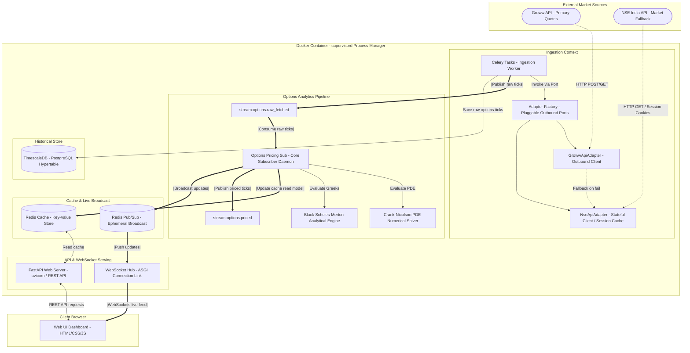
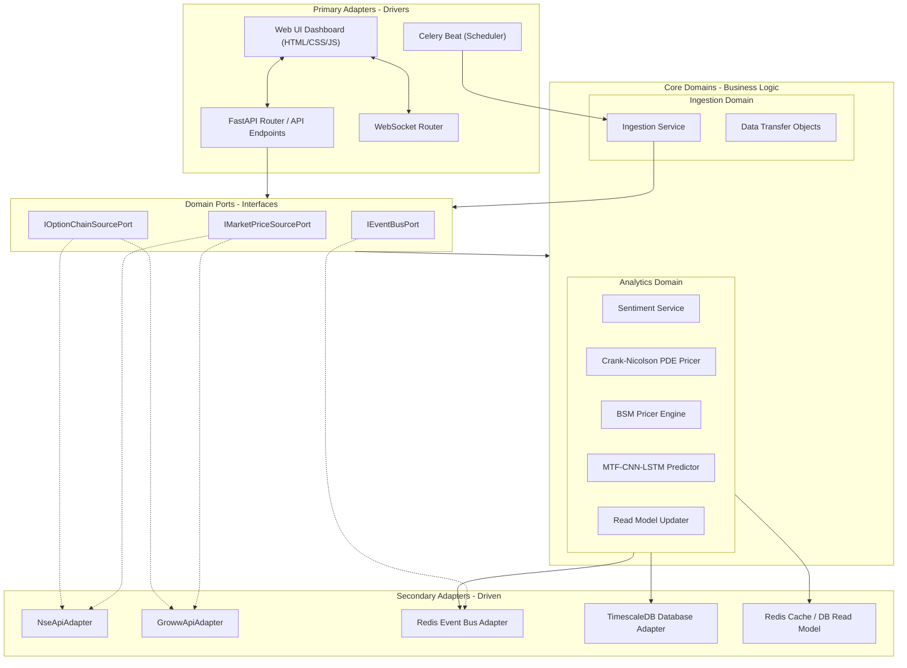
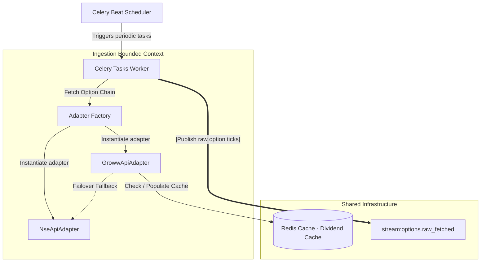
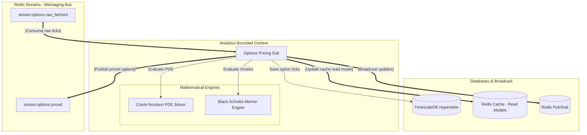
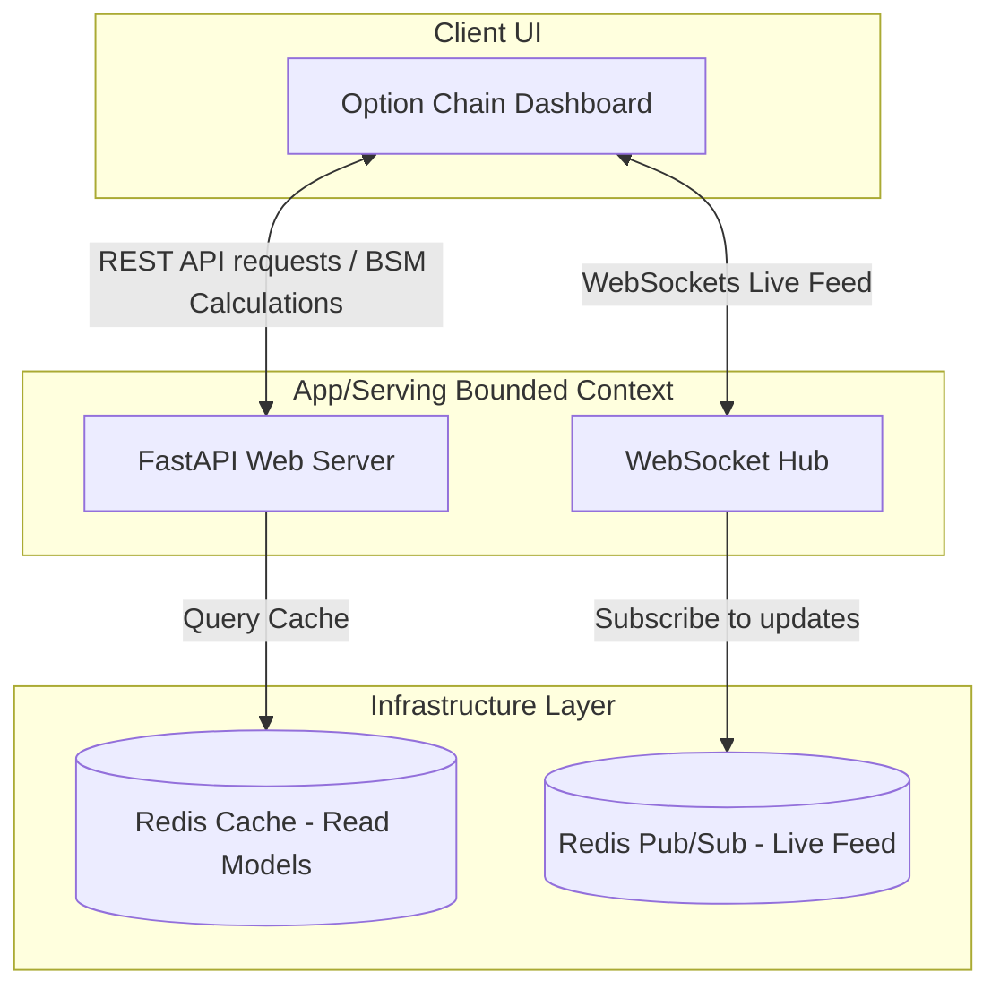

# System Architecture & Design

AlphaStreams V2 is designed as an **Event-Driven Modular Monolith** enforcing strict separation of concerns, decoupling of domains, and clean process segregation inside the container.

---

## 1. System Process Layout

This diagram shows how processes are orchestrated inside the single Docker container, how they interact with external sources, and how data persists/streams across services:

---

## 2. Logical Architecture (DDD & Hexagonal Layers)

This diagram shows the software design pattern, mapping the **Domain-Driven Design (DDD)** bounded contexts and the **Hexagonal (Ports and Adapters) Architecture** layers:

---

## 3. Domain Component Architectures

### A. Ingestion Domain Context
Responsible for task scheduling, pulling market metrics from third-party endpoints using appropriate protocol-level adapters, caching static values (e.g. dividends) to reduce HTTP request volume, and staging raw records onto durable Redis Streams.

### B. Analytics Domain Context
Consumes raw streams asynchronously using subscriber daemons, routes data through numerical evaluation engines, persists results in TimescaleDB, and publishes priced records onto processed streams to update cache layers.

### C. App / Serving Domain Context
Handles incoming client requests, serving REST endpoints by reading from cache and pushing updates in real-time to active user dashboards using WebSockets.

---

## 4. Durable-First Event Model

Cross-domain correctness uses **Redis Streams** (durable, replayable, consumer-group semantics). Pub/Sub is used only for UX/live push.

### Durable streams (state/correctness path)

| Stream | Producer domain | Consumer domain | Notes |
|---|---|---|---|
*   `stream:market.price_trigger` | Ingestion | Analytics | Triggered market anomalies.
*   `stream:options.raw_fetched` | Ingestion | Analytics | Raw option chain ticks for PDE solver.
*   `stream:options.priced` | Analytics | App | Fair-priced option chain output.
*   `stream:analysis.completed` | Analytics | App | Analysis completion signal.
*   `stream:analysis.refresh_requested` | App | Ingestion | Async refresh command path.

### Dead-letter queues (DLQ)

| Stream | Purpose |
|---|---|
*   `stream:dlq:refresh_request` | Failed refresh request events.

### Ephemeral Pub/Sub mirrors (UX-only)

| Channel pattern | Purpose |
|---|---|
*   `market.price_updated.{symbol}` | Live price updates.
*   `market.options_updated.{symbol}` | Live options summary updates.
*   `market.price_trigger.{symbol}` | Live trigger notifications.
*   `alerts.dispatched.{symbol}` | Live alert dispatch notifications.
