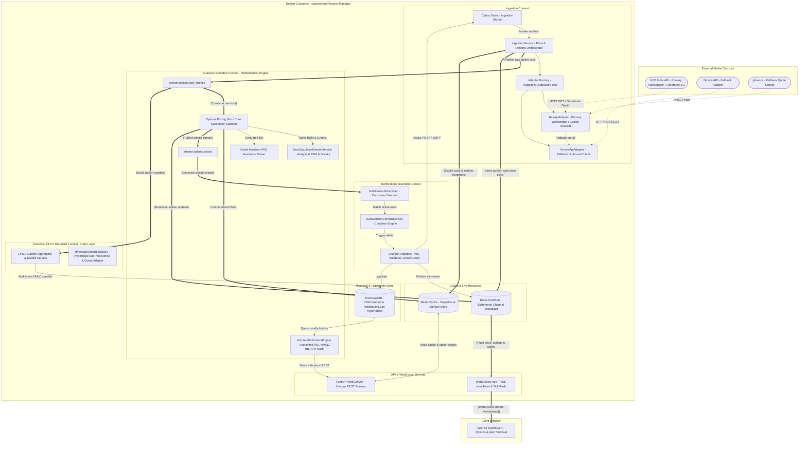
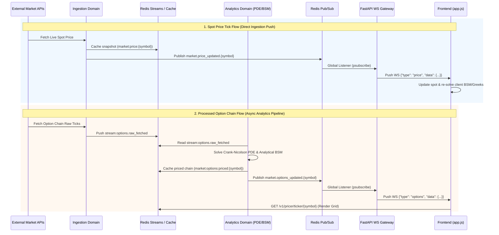

# System Architecture & Mathematical Specifications

AlphaStreams V2 is engineered as a **Modular Monolith** adhering to the principles of **Domain-Driven Design (DDD)** and **Hexagonal (Ports and Adapters) Architecture**. By enforcing strict context boundaries at the package level, the system minimizes coupling and guarantees that domains communicate exclusively via public interfaces (Ports) or asynchronous, durable event streams.

---

## 1. Architectural Philosophy & Bounded Contexts

```
               DDD + Hexagonal Flow

                    Controller
                         │
                 Input Adapter
                         │
          Input Port (Use Case)
                         │
             Application Service
                         │
           Domain (Entities, Aggregates,
           Value Objects, Domain Services)
                         │
                Output Ports (Interfaces)
                         │
               Output Adapters (JPA,
             Kafka, Email, Payment APIs)
```

### Layer Mapping Matrix

| DDD / Hexagonal Layer | Project Architecture | Codebase Location | Examples / Implementation |
|---|---|---|---|
| **Controller / Driving Adapter** | FastAPI Routers & WebSockets | `app/main.py`, `domains/*/api/` | `options.py`, `/v1/ws/{symbol}` WebSocket endpoint |
| **Input Adapter** | Request Handlers & Decoders | `domains/*/api/` | Pydantic request models & FastAPI dependency injection |
| **Input Port (Use Case)** | Service Interfaces | `domains/*/ports/interface/inbound/` | Inbound execution interfaces |
| **Application Service** | Pipeline Orchestrators | `domains/*/application/` | `BSMService`, `OptionChainIngestionService`, Celery tasks |
| **Domain Core** | Entities, Value Objects & Math | `domains/*/domain/` | `OptionChain`, `TickData`, BSM formulas, PDE grid solvers |
| **Output Ports (Interfaces)** | Abstract Data & Client Contracts | `domains/*/ports/interface/outbound/` | `IMarketPriceSourcePort`, `IOptionChainSourcePort` |
| **Output Adapters (Driven)** | External API & Storage Clients | `domains/*/infrastructure/` | `GrowwApiAdapter`, `NseApiAdapter`, `TimescaleDBRepository`, `RedisStreamBus` |


### Active Bounded Contexts

1. **Ingestion Context (`domains/ingestion`)**: Establishes connections to external financial market APIs, maintains stateful sessions, rotates HTTP cookies, parses market payloads, and publishes raw tick data structures to the messaging layer.
2. **Analytics Context (`domains/analytics`)**: The mathematical engine. Consumes ingestion event streams, executes analytical (BSM) and numerical (Crank-Nicolson PDE) option solvers, computes technical indicator formulas (RSI, MACD, Bollinger Bands, ATR, Pivots), and updates read-optimized caches.
3. **Notifications Context (`domains/notifications`)**: Real-time alert engine. Manages user-defined alert rules, evaluates price/IV/delta conditions against live market ticks, dispatches notifications via configurable channels (webhook, email), and enforces cooldown policies.
4. **Historical OHLC Context (`domains/historical`)**: Historical candle persistence & data query engine. Stores immutable 1m/5m/1d bars in TimescaleDB hypertables with 90-day retention policies and provides clean OHLC data series to analytical solvers.
5. **Application & Serving Context (`app/` / `frontend/`)**: Exposes REST and WebSocket gateways using FastAPI to interface with the web client. Serves static assets, provides caching mechanisms for endpoints, and manages low-latency pub/sub streaming to active web connections.
6. **Shared Kernel (`shared/`)**: Provides cross-cutting facilities including database adapters, caching client configurations, global constants, symbol validation rules, structured logging, middleware, and Celery task scheduler application context.

### Directory Taxonomy

```
MarketSentimentAnalysis2/
├── app/
│   ├── config/                        # Pydantic settings & environment configuration
│   ├── bootstrap.py                   # Domain router registration & app bootstrapping
│   └── main.py                        # FastAPI application bootstrapper & middleware
├── domains/
│   ├── ingestion/                     # Ingestion Context
│   │   ├── api/                       # REST endpoint adapters
│   │   ├── application/               # Orchestrators and Celery tasks
│   │   ├── domain/                    # Ingestion domain entities & DTOs
│   │   ├── infrastructure/            # Outbound adapters (NSE, Groww, yfinance)
│   │   ├── ports/                     # Inbound & outbound interface contracts
│   │   └── tasks/                     # Celery task definitions
│   ├── analytics/                     # Analytics Context
│   │   ├── api/                       # REST, Technicals, Pricer & WS entry adapters
│   │   ├── application/               # BSM, PDE & Technical indicator calculators
│   │   ├── domain/                    # Quantitative domain models & entities
│   │   ├── infrastructure/            # Read-model subscribers & cache repositories
│   │   ├── ports/                     # Inbound & outbound interface contracts
│   │   └── tasks/                     # Celery task definitions
│   └── notifications/                 # Notifications Context
│       ├── api/                       # Alert CRUD REST endpoints
│       ├── application/               # Alert management service
│       ├── domain/                    # Alert entities, value objects & rule matching
│       ├── infrastructure/            # Persistence, channels & subscribers
│       └── ports/                     # Inbound & outbound interface contracts
├── shared/                            # Shared Kernel
│   ├── infrastructure/                # Redis connection pools, event bus & streaming
│   ├── constants.py                   # Stream names, TTLs, and keys
│   ├── exceptions/                    # Layered exception hierarchy (API, domain, infra)
│   ├── logging/                       # Structured logging formatters & middleware
│   ├── middleware/                     # Request ID, timing, metrics & auth middleware
│   └── utils/                         # Symbol validation & timezone utilities
├── frontend/                          # Client web assets (HTML5, CSS3, Vanilla JS)
├── scripts/                           # Database migration & catalog tools
├── tests/                             # Unit, integration & e2e test suites (80+ tests)
├── supervisord.conf                   # Multi-process container configuration
├── start.sh                           # Container startup script
└── docker-compose.yml                 # Orchestration manifest
```

---

## 2. Process Layout & Flow Diagram



### Ports & Adapters End-to-End Execution Sequence

```
       Control Call Flow (Top → Down)            Data Return Flow (Bottom ↑ Up)

    [ IngestionService ] (App Service)       [ IngestionService ] (App Service)
             │ (calls port)                           ▲ (returns RawTickDTO)
             ▼                                        │
    [ IOptionChainSourcePort ]               [ IOptionChainSourcePort ]
             │ (implemented by)                       ▲
             ▼                                        │
    [ GrowwApiAdapter ] (Adapter)            [ GrowwApiAdapter ] (Adapter)
             │ (HTTP request)                         ▲ (HTTP response)
             ▼                                        │
      [ Groww / NSE API ]                      [ Groww / NSE API ]
```

### Complete Sequence

```
[ Celery Task ] ──(1. trigger)──> [ IngestionService ]
                                         │
    ┌────────────────────────────────────┴────────────────────────────────────┐
    │ (2. Call Outbound Port)                                                 │ (4. Publish Outbound Port)
    ▼                                                                         ▼
[ IOptionChainSourcePort ]                                            [ IEventBusPort ]
    │ (invokes implementation)                                                │ (invokes implementation)
    ▼                                                                         ▼
[ GrowwApiAdapter ]                                                   [ RedisEventBusAdapter ]
    │                                                                         │
    ├───> HTTP fetch ───> [ External Groww API ]                              │
    │                                 │                                       │
    └───< returns DTO <───────────────┘                                       │
    │                                                                         │
    └───> returns RawTickDTO to IngestionService ─────────────────────────────┼─> Stream publish ──> [ Redis Stream ]
                                                                                                            │
                                                                                                            ▼
                                                                                             [ OptionsPricingSubscriber ]
                                                                                                            │
                                                                                                            ▼
                                                                                                    [ Redis Pub/Sub ]
                                                                                                            │
                                                                                                            ▼
                                                                                                   [ WebSocket Gateway ]
```

1. **Trigger (Driving Input):** Celery task `ingestion.poll_options` fires, invoking Application Service `IngestionService.ingest_options(symbol)`.
2. **Fetch (Outbound Port -> Outbound Adapter):** `IngestionService` invokes `IOptionChainSourcePort.fetch_option_chain(symbol)`. Dependency Injection resolves concrete adapter (`GrowwApiAdapter` / `NseApiAdapter`), returning `RawTickDTO`.
3. **Publish Stream (Outbound Port -> Outbound Adapter):** `IngestionService` invokes `IEventBusPort.publish("stream:options.raw_fetched", data)`. `RedisEventBusAdapter` pushes payload to Redis Stream.
4. **Broadcast (Driven Consumer -> Driving Gateway):** `OptionsPricingSubscriber` consumes stream, computes math domain, pushes to Redis Pub/Sub. FastAPI WebSocket gateway (`/v1/ws/{symbol}`) relays payload to UI.

### Real-Time Live Data WebSocket & Pub/Sub Fan-Out Flow



---

## 3. Ingestion Context & Pluggable Data Adapters

Data ingestion operates via an interface-driven architecture, decoupling pipeline execution from concrete API providers through `IMarketPriceSourcePort` and `IOptionChainSourcePort`.

### Adapter Factory & Session Management
* **`GrowwApiAdapter`**: Primary live option chain and quote retrieval. Handles dynamic access tokens and caches auxiliary data (e.g. dividend yield) in Redis.
* **`NseApiAdapter`**: Connects to NSE India API. Serves as primary driver under `MARKET_DATA_PROVIDER="nse"` or fallback when Groww credentials expire.
* **Session Cookie Rotation**: Performs initial warm-up sequence (`https://www.nseindia.com`) and programmatically refreshes session cookies every 10 minutes (600s).
* **Tiered Market Fallback**:
  1. Redis Cache check.
  2. Primary Adapter (Groww API / `yfinance`).
  3. Secondary NSE Scraper.
  4. **Fail-Fast Error Policy (HTTP 503)**: Purged synthetic mock generators. Returns clean `503 Service Unavailable` if external streams fail.

---

## 4. Option Pricing & Mathematical Solvers

### Analytical Model: Black-Scholes-Merton (BSM)

Closed-form formulation with continuous dividend yield:

$$d_1 = \frac{\ln\left(\frac{S_0}{K}\right) + \left(r - q + \frac{\sigma^2}{2}\right)T}{\sigma\sqrt{T}}$$
$$d_2 = d_1 - \sigma\sqrt{T}$$

* **Call Theoretical Price ($C_{BSM}$):**
  $$C_{BSM} = S_0 e^{-q T} N(d_1) - K e^{-r T} N(d_2)$$
* **Put Theoretical Price ($P_{BSM}$):**
  $$P_{BSM} = K e^{-r T} N(-d_2) - S_0 e^{-q T} N(-d_1)$$

#### Dynamic Greeks Formulations
* **Delta ($\Delta$):** $\Delta_{Call} = e^{-q T} N(d_1), \quad \Delta_{Put} = -e^{-q T} N(-d_1)$
* **Gamma ($\Gamma$):** $\Gamma = \frac{e^{-q T} n(d_1)}{S_0 \sigma \sqrt{T}} \quad \text{where } n(x) = \frac{1}{\sqrt{2\pi}} e^{-\frac{x^2}{2}}$
* **Vega ($\nu$):** $\nu = \frac{S_0 e^{-q T} \sqrt{T} n(d_1)}{100}$
* **Theta ($\Theta$):**
  $$\Theta_{Call} = \frac{- \frac{S_0 e^{-q T} n(d_1) \sigma}{2 \sqrt{T}} + q S_0 e^{-q T} N(d_1) - r K e^{-r T} N(d_2)}{365}$$
  $$\Theta_{Put} = \frac{- \frac{S_0 e^{-q T} n(d_1) \sigma}{2 \sqrt{T}} - q S_0 e^{-q T} N(-d_1) + r K e^{-r T} N(-d_2)}{365}$$
* **Rho ($\rho$):** $\rho_{Call} = \frac{K T e^{-r T} N(d_2)}{100}, \quad \rho_{Put} = \frac{-K T e^{-r T} N(-d_2)}{100}$

---

### Numerical Solver: Crank-Nicolson PDE Scheme

Solves the Black-Scholes partial differential equation:

$$\frac{\partial V}{\partial t} + \frac{1}{2}\sigma^2 S^2 \frac{\partial^2 V}{\partial S^2} + r S \frac{\partial V}{\partial S} - r V = 0$$

#### Grid Discretization & CFL Stability
1. **Stock Price Domain**: $S \in [0, S_{max}]$ with $S_{max} = \max(3K, 2.5S_0)$, grid size $M$ steps ($dS = S_{max}/M$).
2. **Temporal Domain**: $t \in [0, T]$ with $N$ steps ($dt = T/N$).
3. **CFL Stability Check**: Validates $dt \le \frac{0.9}{\sigma^2 M^2} S_{max}^2$, automatically increasing $N$ if stability criterion is violated.

#### Linear System Construction
Discretized implicit/explicit formulation:

$$- \alpha_i V_{i-1}^{j} + (1 + \beta_i) V_i^{j} - \gamma_i V_{i+1}^{j} = \alpha_i V_{i-1}^{j+1} + (1 - \beta_i) V_i^{j+1} + \gamma_i V_{i+1}^{j+1}$$

Where:
$$\alpha_i = -\frac{1}{4} dt \left( \sigma^2 i^2 - r i \right)$$
$$\beta_i = \frac{1}{2} dt \left( \sigma^2 i^2 + r \right)$$
$$\gamma_i = -\frac{1}{4} dt \left( \sigma^2 i^2 + r i \right)$$

Formulated as tridiagonal system: $\mathbf{A} \mathbf{V}^j = \mathbf{B} \mathbf{V}^{j+1}$.

#### SciPy Sparse Matrix LU Optimization
Matrix $\mathbf{A}$ is static and pre-factorized using SuperLU direct solver (`scipy.sparse.linalg.splu`) outside the temporal loop. Resolves backward steps in linear $O(M)$ time via `A_solver.solve(rhs)`.

---

## 5. Storage & Event Streaming Infrastructure

### TimescaleDB Hypertables & Relational Persistence
* **`OhlcCandles` Hypertable**: Partitioned on `timestamp` column. Auto-retention policy drops 1m/5m/1d candles older than 90 days.
* **`NotificationLogs` Hypertable**: Partitioned on `timestamp` column. Auto-retention policy purges triggered alert log entries older than 14 days.
* **`TickData` Hypertable**: Partitioned on `timestamp` column. Automatic data retention drops raw tick chunks older than 7 days.

| Table Name | Partitioning | Primary Columns | Purpose & Retention |
|---|---|---|---|
| `OhlcCandles` | Hypertable | `symbol`, `timestamp`, `timeframe`, `open`, `high`, `low`, `close`, `volume` | Historical 1m/5m/1d candles (90-day retention). |
| `NotificationLogs` | Hypertable | `id`, `rule_id`, `symbol`, `condition_type`, `triggered_value`, `threshold`, `message`, `status`, `timestamp` | Triggered alert audit log (14-day retention). |
| `AlertRules` | Relational | `id`, `symbol`, `condition_type`, `threshold`, `channels`, `cooldown_seconds`, `is_active` | User-defined alert rules & destinations. |
| `TickData` | Hypertable | `Timestamp`, `Symbol`, `StrikePrice`, `LastPrice`, `Volume`, `ImpliedVolatility` | Raw tick database (7-day retention). |
| `DomainEvents` | Relational | `EventId` (UUID), `EventType`, `Payload` (JSONB), `OccurredAt` | Cross-domain event audit log. |

### Redis Streams Messaging Architecture
1. `stream:options.raw_fetched`: Ingestion worker pushes raw tick blocks.
2. `stream:options.priced`: `OptionsPricingSubscriber` daemon consumes ticks, solves BSM/PDE, and writes processed results.
3. `stream:analysis.refresh_requested`: Analytics domain requests ingestion refresh for a symbol.
4. `stream:dlq:refresh_request`: Dead-Letter Queue isolates processing failures after 3 retries.
5. `market.options_updated.{symbol}` / `market.price_updated.{symbol}`: Ephemeral Pub/Sub channels mirror tick & chain updates to WebSocket hub (`/v1/ws/{symbol}`).
6. `alerts.dispatched.{symbol}`: Ephemeral Pub/Sub channel for alert notifications pushed to WebSocket clients.

---

## 6. Frontend SPA & Client Math Engine

* **SPA Architecture**: Dark glassmorphic trading terminal layout in vanilla HTML5/CSS3/JS.
* **Client BSM Simulation**: Runs Hastings' cumulative normal distribution approximation ($N(x)$) inside browser JS for zero-latency slider calculations:

```javascript
function normalCDF(x) {
    const b1 = 0.319381530, b2 = -0.356563782, b3 = 1.781477937, 
          b4 = -1.821255978, b5 = 1.330274429, p = 0.2316419;
    const t = 1.0 / (1.0 + p * Math.abs(x));
    const poly = t * (b1 + t * (b2 + t * (b3 + t * (b4 + t * b5))));
    const cdf = 1.0 - (1.0 / Math.sqrt(2 * Math.PI)) * Math.exp(-0.5 * x * x) * poly;
    return x >= 0 ? cdf : 1.0 - cdf;
}
```

---

## 7. Regulatory Compliance & Disclaimers

### SEBI Risk Disclosure
> "9 out of 10 individual traders in equity derivatives segment incurred net losses, averaging ₹50,000 loss per year, with an additional 28% in transaction costs."

### Investment Disclaimer
All theoretical pricing metrics and PDE outputs are strictly for research and educational purposes. The platform operators are not registered SEBI Investment Advisers (IA) or Research Analysts (RA).
