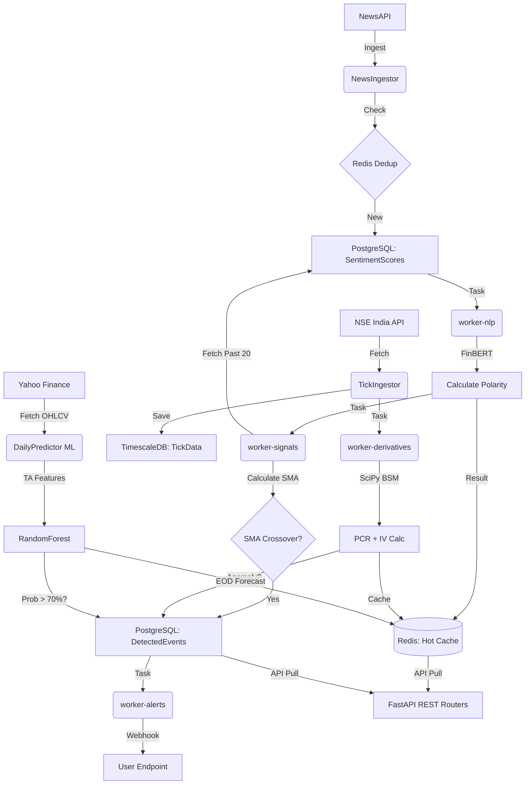

# AlphaStreams — Project Walkthrough & Onboarding

Welcome to the **Alpha Streams** backend! This document summarizes the project's current architecture, completed milestones, and the underlying event-driven philosophy so that new coworkers can easily pick up where we left off.

## 📌 Project Overview & Data Pipelines
We are building an **Institutional-Grade Quantitative Analytics Engine**. The platform leverages three completely independent Event-Driven Data Pipelines to track the market and trigger alerts:

### 🌊 Pipeline A: News Sentiment (`/NewsSentiment`)
**The "Confirming Indicator" (Public Narrative)**
- Ingests financial news, scores it using FinBERT AI, and computes Moving Averages (SMA) to mathematically track shifting public sentiment trends.

### 🌊 Pipeline B: Quantitative Math Engine (`/Derivatives`)
**The "Leading Indicator" (Smart Money / Institutional Footprint)**
- Fetches real-time F&O option chain data directly from the NSE India API.
- Back-solves the Black-Scholes-Merton formula (via SciPy) to compute instantaneous Implied Volatility (IV) and tracks Put-Call Ratios to read institutional leverage.
- Detects massive sweeps/anomalies in Open Interest and volume patterns.

### 🌊 Pipeline C: Machine Learning Forecaster (`/MLForecasting`)
**The "Statistical Engine" (End-of-Day Predictions)**
- Transforms massive OHLCV datasets into pure-Pandas Technical Indicators (MACD, Bollinger Bands, RSI).
- Feeds features into a meticulously trained Random Forest Classifier to output statistical probabilities of the next day's price movement.

**Tech Stack:**
* **REST API:** FastAPI
* **Message Broker / Workers:** Celery + Redis
* **Database:** PostgreSQL (TimescaleDB)
* **ML Inference:** PyTorch + HuggingFace Transformers (FinBERT)
* **Quantitative Math:** SciPy (Brent's root-finding, BSM pricing)
* **Market Data:** NSE India API (free, no key needed)

## ✅ Accomplishments to Date (Phases 0–4)

### Phases 0–2: Sentiment Pipeline (Event-Driven)

1. **The Ingestion Hand-Off:**
   `NewsIngestor.py` pulls articles from NewsAPI and deduplicates them against Redis. It strictly verifies the Celery task dispatch *before* caching to prevent data drops on broker failures.

2. **The NLP Inference Engine (`worker-nlp`):**
   A dedicated Celery worker scores text using FinBERT. It converts confidence probabilities into hard Polarity Scores (supporting both `NEGATIVE` and model-specific `BEARISH` labels) ranging from `[-1.0 to 1.0]`.

3. **The Signal Composer (`worker-signals`):**
   Upon NLP success, `SignalComposer.py` fetches the last 20 finalized polar scores to calculate a **Simple Moving Average (SMA)**. It detects technical crossovers (e.g., `STRONG_BULLISH_CROSSOVER >= 0.70`) by comparing against cached values in Redis.

4. **Alert Dispatching:**
   If a crossover fires, `AlertDispatcher.py` queries `AlertRules` and blasts JSON POST payloads using an `asyncio.Semaphore(50)` to securely limit concurrent TCP sockets.

5. **Hot APIs:**
   Built `SignalsRouter.py` and `EventsRouter.py` to allow the frontend UI to consume real-time Moving Averages (pulled in `<1ms` from Redis) and the historical timeline of crossover events.

### Phase 3: Derivatives Analytics

6. **MetricsComputer (BSM + SciPy):**
   `MetricsComputer.py` processes incoming tick batches to compute:
   - **PCR** (Put-Call Ratio) from aggregated CE/PE volumes per symbol/expiry
   - **Implied Volatility** per strike using `scipy.optimize.brentq` to solve the BSM equation, with Corrado-Miller approximation as fallback for edge cases
   - Results cached in Redis for instant API access

7. **Anomaly Detection (Rule-Based):**
   `AnomalyDetector.py` uses exponentially smoothed rolling averages to detect:
   - **OI Surges** — single-strike OI exceeding 3× the rolling average
   - **Volume Sweeps** — total CE/PE volume spiking 5× the trailing average
   - Anomalies are persisted to `DetectedEvents` and emitted to the existing AlertDispatcher webhook pipeline

8. **Derivatives API:**
   `DerivativesRouter.py` exposes `GET /v1/derivatives/{symbol}` returning PCR, IV surface, and recent anomalies.

### Phase 4: Live Tick Data Ingestion

9. **NSE India Live Feed:**
   `TickIngestor.py` fetches real-time option chain data directly from the NSE India website API (free, no key needed). It handles cookie-based authentication, parses the full option chain JSON, and falls back to mock data per-symbol if NSE is unreachable.

10. **Celery Periodic Tasks:**
    `DataIngestion/Tasks.py` defines periodic tasks for both news and tick ingestion cycles, runnable via Celery Beat.

### Phase 5: Machine Learning Daily Predictor

11. **EOD Forecasting (Random Forest):**
    `TrainDailyPredictor.py` downloads 5 years of daily OHLCV data from Yahoo Finance, engineers technical indicators (RSI, MACD, BB, ATR) using pure Pandas math, and trains a universal binary classification model to predict if tomorrow's close will be strictly higher than today's.
    
12. **Live Inference Engine:**
    `DailyPredictor.py` loads the `.joblib` pipeline into RAM. Triggered by a Celery Beat schedule everyday at 3:45 PM IST, it fetches the last 60 days of live market data, reconstructs the identical TA features used during training, and logs probability forecasts to Redis. High conviction predictions (>70%) are automatically emitted to the `AlertDispatcher` webhook pipeline.
    
13. **Predictions API:**
    `PredictionsRouter.py` provides `GET /v1/predictions/{symbol}` with AI probability scores.

## 📊 Technical Data Flow

### 🛠️ Method & File Mapping
| **Stage** | **File Path** | **Primary Method(s)** |
|:---|:---|:---|
| **News Ingestion** | `NewsSentiment/Ingestion/NewsIngestor.py` | `IngestForSymbol()`, `_FetchFromNewsApi()` |
| **Deduplication** | `NewsSentiment/Ingestion/NewsIngestor.py` | `_IsDuplicate()`, `_MarkSeen()` |
| **NLP Scoring** | `NewsSentiment/Tasks.py` | `ProcessArticleTask()` |
| **AI Inference** | `NewsSentiment/AI_Engine/FinBertClient.py` | `ScoreBatch()` |
| **Aggregation** | `NewsSentiment/Alerts/SignalComposer.py` | `ProcessNewSentiment()` |
| **Crossover** | `NewsSentiment/SignalTasks.py` | `ComposeSignalTask()` |
| **Dispatching** | `NewsSentiment/Alerts/AlertDispatcher.py` | `Dispatch()` |
| **Tick Ingestion** | `Derivatives/Ingestion/TickIngestor.py` | `IngestOnce()`, `_FetchFromNSE()` |
| **PCR + IV** | `Derivatives/Analytics/MetricsComputer.py` | `ProcessTickBatch()`, `_ComputeIV()` |
| **Anomalies** | `Derivatives/Anomalies/AnomalyDetector.py` | `CheckForAnomalies()` |
| **ML Training**  | `scripts/TrainDailyPredictor.py` | `EngineerFeatures()`, `Pipe.fit()` |
| **ML Inference** | `MLForecasting/Inference/DailyPredictor.py` | `PredictNextDay()` |
| **API — Sentiment** | `Analytics/SentimentRouter.py` | `GetLatestSentiment()` |
| **API — Signals** | `Analytics/SignalsRouter.py` | `GetLatestSignal()` |
| **API — Events** | `Analytics/EventsRouter.py` | `GetEventsTimeline()` |
| **API — Derivatives** | `Analytics/DerivativesRouter.py` | `GetDerivativesSnapshot()` |
| **API — ML Forecasts** | `Analytics/PredictionsRouter.py` | `GetLatestPrediction()` |

## 🛡️ DevOps & Security Improvements
* **Image Size Reduction**: Transitioned to **Multi-Stage Builds** and **CPU-Only PyTorch**, reducing the image size by ~2.5GB and preventing WSL2 disk bloat.
* **Network Hardening**: Blocked unauthenticated LAN scans by removing host-level port bindings for `Postgres` and `Redis`. All database traffic is now strictly internal to the Docker network.
* **Healthchecks**: Implemented `postgres_ready` healthchecks on Compose boot so FastAPI and Celery wait for the database to be fully ready before connecting.
* **Hot-Reloading**: All Celery workers are mapped via `volumes`. Simply save any python file, and the workers will hot-reload on the next task!

## 🔜 Next Steps
Review `research_fno_pivot.md` for the long-term vision (LSTM fair-value model, social media alt-data, advanced F&O dashboard).
